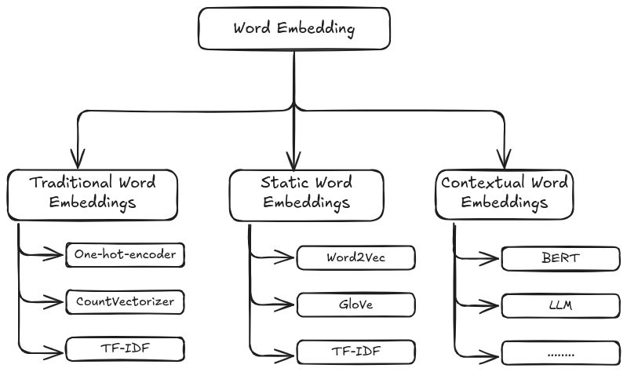

.. _embedding:

===========================
Word and Sentence Embedding
===========================

Word embedding is a method in natural language processing (NLP) to represent words as dense 
vectors of real numbers, capturing semantic relationships between them. Instead of treating 
words as discrete symbols (like one-hot encoding), word embeddings map words into a 
continuous vector space where similar words are located closer together.

.. _fig_embedding:

    Embedding Diagram

Traditional word embeddings
+++++++++++++++++++++++++++

**Bag of Words (BoW)** is a simple and widely used text representation technique in natural 
language processing (NLP). It represents a text (e.g., a document or a sentence) as a collection 
of words, ignoring grammar, order, and context but keeping their frequency.

Key Features of Bag of Words:

1. **Vocabulary Creation**:
   - A list of all unique words in the dataset (the "vocabulary") is created.
   - Each word becomes a feature.

2. **Representation**:
   - Each document is represented as a vector or a frequency count of words from the vocabulary.
   - If a word from the vocabulary is present in the document, its count is included in the vector.
   - Words not present in the document are assigned a count of zero.

3. **Simplicity**:
   - The method is computationally efficient and straightforward.
   - However, it ignores the sequence and semantic meaning of the words.

Applications:

- Text Classification
- Sentiment Analysis
- Document Similarity

Limitations:

1. **Context Ignorance**:
   - BoW does not capture word order or semantics.
   - For example, "not good" and "good" might appear similar in BoW.

2. **Dimensionality**:
   - As the vocabulary size increases, the vector representation grows, leading to high-dimensional data.

3. **Sparse Representations**:
   - Many entries in the vectors might be zeros, leading to sparsity.

One Hot Encoder
---------------

.. code-block:: python 

   import numpy as np
   import pandas as pd
   from collections import Counter
   from sklearn.preprocessing import OneHotEncoder

   # sample corpus
   data = pd.DataFrame({'word':['python', 'pyspark', 'genai', 'pyspark', 'python', 'pyspark']})

   # corpus frequency
   print('Vocabulary frequency:')
   print(dict(Counter(data['word'])))

   # corpus order
   print('\nVocabulary order:')
   print(sorted(set(data['word'])))

   # One-hot encode the data
   onehot_encoder = OneHotEncoder(sparse_output=False)
   onehot_encoded = onehot_encoder.fit_transform(data[['word']])

   # the encoded order base on the order of the copus
   print('\nEncoded representation:')
   print(onehot_encoded)

.. code-block:: python 

   Vocabulary frequency:
   {'python': 2, 'pyspark': 3, 'genai': 1}

   Vocabulary order:
   ['genai', 'pyspark', 'python']

   Encoded representation:
   [[0. 0. 1.]
   [0. 1. 0.]
   [1. 0. 0.]
   [0. 1. 0.]
   [0. 0. 1.]
   [0. 1. 0.]]   

CountVectorizer
---------------

.. code-block:: python 

   from sklearn.feature_extraction.text import CountVectorizer

   # sample corpus
   corpus = [
   'Gen AI is awesome',
   'Gen AI is fun',
   'Gen AI is hot'
   ]

   # Initialize the CountVectorizer
   vectorizer = CountVectorizer()

   # Fit and transform
   X = vectorizer.fit_transform(corpus)

   print('Vocabulary:')
   print(vectorizer.get_feature_names_out())

   print('\nEmbedded representation:')
   print(X.toarray())

.. code-block:: python  

   Vocabulary:
   ['ai' 'awesome' 'fun' 'gen' 'hot' 'is']

   Embedded representation:
   [[1 1 0 1 0 1]
   [1 0 1 1 0 1]
   [1 0 0 1 1 1]]  

To overcome these limitations, advanced techniques like **TF-IDF**, **word embeddings** 
(e.g., Word2Vec, GloVe), and contextual embeddings (e.g., BERT) are often used.

TF-IDF
------

**TF-IDF (Term Frequency-Inverse Document Frequency)** is a statistical measure used 
in text analysis to evaluate the importance of a word in a document relative to a 
collection (or corpus) of documents. It builds upon the **Bag of Words (BoW)** model
by not only considering the frequency of a word in a document but also taking 
into account how common or rare the word is across the corpus.

- Components of TF-ID

- **t**: the term in corpus.

- **d**: the document.

- **D**: the corpus.

- **|D|**: the length of the corpus or total number of documents.

   - **Document Frequency (DF)**:
   - :math:`DF(t,D)`: the number of documents that contains term :math:`t`.

   - **Term Frequency (TF)**:
      - Measures how frequently a term appears in a document. The higher the frequency, the more important the term is assumed to be to that document.
      - Formula:  

      .. math::

         TF(t, d) = \frac{\text{Number of occurrences of term } t \text{ in document } d}{\text{Total number of terms in document } d}
      

   - **Inverse Document Frequency (IDF)**:
      - Measures how important a term is by reducing the weight of common terms (like "the" or "and") that appear in many documents.
      - Formula: 

      .. math::

         IDF(t, D) = \log\left(\frac{|D|+1}{DF(t,D) + 1}\right) + 1
      
      - Adding 1 to the denominator avoids division by zero when a term is present in all documents.
      - Note that the IDF formula above differs from the standard textbook notation that defines the IDF

      .. note::

         The IDF formula above differs from the standard textbook notation that defines the IDF as 
         
         .. math::

         IDF(t) = \log [ |D| / (DF(t,D) + 1) ]).

   - **TF-IDF Score**:
      - The final score is the product of TF and IDF.
      - Formula: 

      .. math::

         TF\text{-}IDF(t, d, D) = TF(t, d) \cdot IDF(t, D)

   .. code-block:: python  
         
      import pandas as pd
      import numpy as np
      from collections import Counter
      from sklearn.feature_extraction.text import TfidfVectorizer

      # sample corpus
      corpus = [
      'Gen AI is awesome',
      'Gen AI is fun',
      'Gen AI is hot'
      ]

      # Initialize the TfidfVectorizer
      vectorizer = TfidfVectorizer() # norm default norm='l2'

      # Fit and transform
      X = vectorizer.fit_transform(corpus)

      print('Vocabulary:')
      print(vectorizer.get_feature_names_out())

      # [item for row in matrix for item in row]
      corpus_flatted = [item for sub_list in [s.split(' ') for s in corpus]
                           for item in sub_list]

      print('\nVocabulary frequency:')
      print(dict(Counter(corpus_flatted)))

      print('\nEmbedded representation:')
      print(X.toarray())

   .. code-block:: python  

      Vocabulary:
      ['ai' 'awesome' 'fun' 'gen' 'hot' 'is']

      Vocabulary frequency:
      {'Gen': 3, 'AI': 3, 'is': 3, 'awesome': 1, 'fun': 1, 'hot': 1}

      Embedded representation:
      [[0.41285857 0.69903033 0.         0.41285857 0.         0.41285857]
      [0.41285857 0.         0.69903033 0.41285857 0.         0.41285857]
      [0.41285857 0.         0.         0.41285857 0.69903033 0.41285857]]   

   The above results can be validated by the following steps (IDF in document 1):

   .. code-block:: python  
         
      # Step 1: Vocabulary  `['ai' 'awesome' 'fun' 'gen' 'hot' 'is']`

      tf_idf = pd.DataFrame({'term':vectorizer.get_feature_names_out()})\
               .set_index('term')

      # Step 2: |D|
      tf_idf['|D|'] = [len(corpus)]*len(vectorizer.get_feature_names_out())

      # Step 3: Compute TF for doc 1:  Gen AI is awesome
      # - TF for "ai" in Document 1 = 1 (appears once doc 1)
      # - TF for "awesome" in Document 1 = 1 (appears once in doc 1)
      # - TF for "fun" in Document 1 = 0 (does not appear in doc 1)
      # - TF for "gen" in Document 1 = 1 (appear oncein doc 1 )
      # - TF for "hot" in Document 1 = 0 (does not appear doc 1 )
      # - TF for "is" in Document 1 = 1 (appear once in doc 1 )

      tf_idf['TF'] = [1, 1, 0, 1, 0, 1]

      # Step 4:  Compute DF for doc 1
      # - DF For "ai": Appears in all 3 documents.
      # - DF For "awesome": Appears in 1 document.
      # - DF For "fun": Appears in 1 document.
      # - DF For "Gen": Appears in all 3 documents.
      # - DF For "hot": Appears in 1 document.
      # - DF For "is": Appears in all 3 documents.

      tf_idf['DF'] = [3, 1, 1, 3, 1, 3]

      # Step 5: Compute IDF
      tf_idf['IDF'] = np.log((tf_idf['|D|']+1)/(tf_idf['DF']+1))+1

      # Step 6: Compute TF-IDF
      tf_idf['TF-IDF'] = tf_idf['TF']*tf_idf['IDF']

      # Step 7: l2 normlization
      tf_idf['TF-IDF(l2)'] = tf_idf['TF-IDF']/np.linalg.norm(tf_idf['TF-IDF'])

      print(tf_idf)

   .. code-block:: python  

               |D|  TF  DF       IDF    TF-IDF  TF-IDF(l2)
      term                                                
      ai         3   1   3  1.000000  1.000000    0.412859
      awesome    3   1   1  1.693147  1.693147    0.699030
      fun        3   0   1  1.693147  0.000000    0.000000
      gen        3   1   3  1.000000  1.000000    0.412859
      hot        3   0   1  1.693147  0.000000    0.000000
      is         3   1   3  1.000000  1.000000    0.412859

   .. admonition:: Fun Fact 

      TfidfVectorizer is equivalent to CountVectorizer followed by TfidfTransformer.

      .. code-block:: python 

         import pandas as pd
         import numpy as np
         from sklearn.feature_extraction.text import CountVectorizer
         from sklearn.feature_extraction.text import TfidfTransformer
         from sklearn.pipeline import Pipeline

         # sample corpus
         corpus = [
         'Gen AI is awesome',
         'Gen AI is fun',
         'Gen AI is hot'
         ]

         # pipeline
         pipe = Pipeline([('count', CountVectorizer(lowercase=True)),
                        ('tfid', TfidfTransformer())]).fit(corpus)
         print(pipe)

         # TF
         print(pipe['count'].transform(corpus).toarray())

         # IDF
         print(pipe['tfid'].idf_)

      .. code-block:: python      

         Pipeline(steps=[('count', CountVectorizer()), ('tfid', TfidfTransformer())])
         [[1 1 0 1 0 1]
         [1 0 1 1 0 1]
         [1 0 0 1 1 1]]
         [1.         1.69314718 1.69314718 1.         1.69314718 1.        ]

- Applications of TF-IDF

   1. **Information Retrieval**: Ranking documents based on relevance to a query.
   2. **Text Classification**: Feature extraction for machine learning models.
   3. **Document Similarity**: Comparing documents by their weighted term vectors.

- Advantages

   - Highlights important terms while reducing the weight of common terms.
   - Simple to implement and effective for many tasks.

- Limitations

   - Does not capture semantic relationships or word order.
   - Less effective for very large corpora or when working with very short documents.
   - Sparse representation due to high-dimensional feature vectors.

For more advanced representations, embeddings like **Word2Vec** or **BERT** are often used.

Static word embeddings 
++++++++++++++++++++++

Static word embeddings are word representations that assign a fixed vector to each word, 
regardless of its context in a sentence or paragraph. These embeddings are pre-trained on 
large corpora and remain unchanged during usage, making them "static." These embeddings are 
usually pre-trained on large text corpora using algorithms like Word2Vec, GloVe, or FastText.

Word2Vec
--------

- The Context Window

- CBOW and Skip-Gram Model 

.. code-block:: python      

   import gensim
   from gensim.models import Word2Vec
   from nltk.tokenize import sent_tokenize, word_tokenize

   # sample corpus
   corpus = [
   'Gen AI is awesome',
   'Gen AI is fun',
   'Gen AI is hot'
   ]

   def tokenize_gensim(corpus):

      tokens = []
      # iterate through each sentence in the corpus
      for s in corpus:

         # tokenize the sentence into words
         temp = gensim.utils.tokenize(s, lowercase=True, deacc=False, \
                                       errors='strict', to_lower=False, \
                                       lower=False)

         tokens.append(list(temp))

      return tokens

   tokens = tokenize_gensim(corpus)

   # Create Word2Vec model
   # sg ({0, 1}, optional) – Training algorithm: 1 for skip-gram; otherwise CBOW.
   # CBOW
   model1 = gensim.models.Word2Vec(tokens, sg=0, min_count=1,
                                 vector_size=10, window=5)

   # Vocabulary
   print(model1.wv.key_to_index)

   print(model1.wv.get_normed_vectors())

   # Print results
   print("Cosine similarity between 'gen' " +
         "and 'ai' - Word2Vec(CBOW) : ",
         model1.wv.similarity('gen', 'ai'))

   # Create Word2Vec model
   # sg ({0, 1}, optional) – Training algorithm: 1 for skip-gram; otherwise CBOW.
   # skip-gram
   model2 = gensim.models.Word2Vec(tokens, sg=1, min_count=1,
                                 vector_size=10, window=5)

   # Vocabulary
   print(model2.wv.key_to_index)

   print(model2.wv.get_normed_vectors())

   # Print results
   print("Cosine similarity between 'gen' " +
         "and 'ai' - Word2Vec(skip-gram) : ",
         model2.wv.similarity('gen', 'ai'))

.. code-block:: python   

   {'is': 0, 'ai': 1, 'gen': 2, 'hot': 3, 'fun': 4, 'awesome': 5}
   [[-0.02660277  0.0117296   0.25318226  0.44695902 -0.4615286  -0.35307196
      0.3204311   0.4451589  -0.24882038 -0.18670462]
   [ 0.41619968 -0.08647515 -0.2558276   0.3695945  -0.274073   -0.10240843
      0.1622154   0.05593351 -0.46721786 -0.5328355 ]
   [ 0.43418837  0.30108306  0.40128633  0.0453006   0.37712952 -0.20221795
   -0.05619935  0.34255028 -0.44665098 -0.2337343 ]
   [-0.41098067 -0.05088534  0.5218584  -0.40045303 -0.12768732 -0.10601949
      0.44194022 -0.32449666  0.00247097 -0.2600907 ]
   [-0.44081825  0.22984274 -0.40207896 -0.20159177 -0.00161115 -0.0135952
   -0.3516631   0.44133204  0.2286844   0.423816  ]
   [-0.42753762  0.23561442 -0.21681462  0.04321203  0.44539306 -0.23385239
      0.23675178 -0.35568893 -0.18596812  0.49255413]]
   Cosine similarity between 'gen' and 'ai' - Word2Vec(CBOW) :  0.32937223
   {'is': 0, 'ai': 1, 'gen': 2, 'hot': 3, 'fun': 4, 'awesome': 5}
   [[-0.02660277  0.0117296   0.25318226  0.44695902 -0.4615286  -0.35307196
      0.3204311   0.4451589  -0.24882038 -0.18670462]
   [ 0.41619968 -0.08647515 -0.2558276   0.3695945  -0.274073   -0.10240843
      0.1622154   0.05593351 -0.46721786 -0.5328355 ]
   [ 0.43418837  0.30108306  0.40128633  0.0453006   0.37712952 -0.20221795
   -0.05619935  0.34255028 -0.44665098 -0.2337343 ]
   [-0.41098067 -0.05088534  0.5218584  -0.40045303 -0.12768732 -0.10601949
      0.44194022 -0.32449666  0.00247097 -0.2600907 ]
   [-0.44081825  0.22984274 -0.40207896 -0.20159177 -0.00161115 -0.0135952
   -0.3516631   0.44133204  0.2286844   0.423816  ]
   [-0.42753762  0.23561442 -0.21681462  0.04321203  0.44539306 -0.23385239
      0.23675178 -0.35568893 -0.18596812  0.49255413]]
   Cosine similarity between 'gen' and 'ai' - Word2Vec(skip-gram) :  0.32937223

GloVE
-----

.. code-block:: python  

   import gensim.downloader as api
   # Download pre-trained GloVe model
   glove_vectors = api.load("glove-wiki-gigaword-50")
   # Get word vectors (embeddings)
   word1 = "king"
   word2 = "queen"
   vector1 = glove_vectors[word1]
   vector2 = glove_vectors[word2]
   # Compute cosine similarity between the two word vectors
   similarity = glove_vectors.similarity(word1, word2)
   print(f"Word vectors for '{word1}': {vector1}")
   print(f"Word vectors for '{word2}': {vector2}")
   print(f"Cosine similarity between '{word1}' and '{word2}': {similarity}")

.. code-block:: python   

   [==================================================] 100.0% 66.0/66.0MB downloaded
   Word vectors for 'king': [ 0.50451   0.68607  -0.59517  -0.022801  0.60046  -0.13498  -0.08813
   0.47377  -0.61798  -0.31012  -0.076666  1.493    -0.034189 -0.98173
   0.68229   0.81722  -0.51874  -0.31503  -0.55809   0.66421   0.1961
   -0.13495  -0.11476  -0.30344   0.41177  -2.223    -1.0756   -1.0783
   -0.34354   0.33505   1.9927   -0.04234  -0.64319   0.71125   0.49159
   0.16754   0.34344  -0.25663  -0.8523    0.1661    0.40102   1.1685
   -1.0137   -0.21585  -0.15155   0.78321  -0.91241  -1.6106   -0.64426
   -0.51042 ]
   Word vectors for 'queen': [ 0.37854    1.8233    -1.2648    -0.1043     0.35829    0.60029
   -0.17538    0.83767   -0.056798  -0.75795    0.22681    0.98587
   0.60587   -0.31419    0.28877    0.56013   -0.77456    0.071421
   -0.5741     0.21342    0.57674    0.3868    -0.12574    0.28012
   0.28135   -1.8053    -1.0421    -0.19255   -0.55375   -0.054526
   1.5574     0.39296   -0.2475     0.34251    0.45365    0.16237
   0.52464   -0.070272  -0.83744   -1.0326     0.45946    0.25302
   -0.17837   -0.73398   -0.20025    0.2347    -0.56095   -2.2839
   0.0092753 -0.60284  ]
   Cosine similarity between 'king' and 'queen': 0.7839043140411377

Fast Text 
---------

Fast Text incorporates subword information (useful for handling rare or unseen words)

.. code-block:: python   

   from gensim.models import FastText

   import gensim
   from gensim.models import Word2Vec

   # sample corpus
   corpus = [
   'Gen AI is awesome',
   'Gen AI is fun',
   'Gen AI is hot'
   ]

   def tokenize_gensim(corpus):

      tokens = []
      # iterate through each sentence in the corpus
      for s in corpus:

         # tokenize the sentence into words
         temp = gensim.utils.tokenize(s, lowercase=True, deacc=False, \
                                       errors='strict', to_lower=False, \
                                       lower=False)

         tokens.append(list(temp))

      return tokens

   tokens = tokenize_gensim(corpus)

   # create FastText model
   model = FastText(tokens, vector_size=10, window=5, min_count=1, workers=4)
   # Train the model
   model.train(tokens, total_examples=len(tokens), epochs=10)

   # Vocabulary
   print(model.wv.key_to_index)

   print(model.wv.get_normed_vectors())

   # Print results
   print("Cosine similarity between 'gen' " +
         "and 'ai' - Word2Vec : ",
         model.wv.similarity('gen', 'ai'))

.. code-block:: python   

   WARNING:gensim.models.word2vec:Effective 'alpha' higher than previous training cycles
   {'is': 0, 'ai': 1, 'gen': 2, 'hot': 3, 'fun': 4, 'awesome': 5}
   [[-0.01875759  0.086543   -0.25080433  0.2824868  -0.23755953 -0.11316587
      0.473383    0.39204055 -0.30422893 -0.5566626 ]
   [ 0.5088161  -0.3323528  -0.128698   -0.11877266 -0.38699347  0.20977001
      0.05947014 -0.05622245 -0.36257952 -0.5177341 ]
   [ 0.18038039  0.51484865  0.40694886  0.05965518 -0.05985437 -0.10832689
      0.37992737  0.5992712   0.01503773  0.1192203 ]
   [-0.5694013   0.23560704  0.0265804  -0.41392225 -0.00285366 -0.3076269
      0.2076883  -0.425648    0.29903153  0.19965051]
   [-0.23892775  0.10744874 -0.03730153 -0.23521401  0.32083488  0.21598674
   -0.29570717 -0.03044808  0.75250715  0.26538488]
   [-0.31881964 -0.06544963 -0.44274488  0.15485793  0.39120612 -0.05415314
      0.15772066 -0.05987714 -0.6986104   0.03967094]]
   Cosine similarity between 'gen' and 'ai' - Word2Vec :  -0.21662527

Contextual word embeddings 
++++++++++++++++++++++++++

Contextual word embeddings are word representations where the embedding of a word 
changes depending on its context in a sentence or document. These embeddings capture 
the meaning of a word as influenced by its surrounding words, addressing the limitations 
of static embeddings by incorporating contextual nuances.

BERT
----

.. code-block:: python  

   from transformers import BertTokenizer, BertModel
   tokenizer = BertTokenizer.from_pretrained('bert-base-uncased')
   model = BertModel.from_pretrained("bert-base-uncased")

   text = "Gen AI is awesome"
   encoded_input = tokenizer(text, return_tensors='pt')
   
   print(encoded_input)
   print({x : tokenizer.encode(x, add_special_tokens=False) for x in ['[CLS]']+ text.split()+ ['[SEP]', '[EOS]']})

.. code-block:: python

   t{'input_ids': tensor([[  101,  8991,  9932,  2003, 12476,   102]]), 'token_type_ids': tensor([[0, 0, 0, 0, 0, 0]]), 'attention_mask': tensor([[1, 1, 1, 1, 1, 1]])}
   {'[CLS]': [101], 'Gen': [8991], 'AI': [9932], 'is': [2003], 'awesome': [12476], '[SEP]': [102], '[EOS]': [1031, 1041, 2891, 1033]}    

gte-large-en-v1.5
-----------------

The ``gte-large-en-v1.5`` is a state-of-the-art text embedding model developed
by Alibaba's Institute for Intelligent Computing. It's designed for natural 
language processing tasks and excels in generating dense vector representations 
(embeddings) of text for applications such as text retrieval, classification, 
clustering, and reranking.

It can handle up to 8192 tokens, making it suitable for long-context tasks. More 
details can be found at: https://huggingface.co/Alibaba-NLP/gte-large-en-v1.5 .

.. code-block:: python

   import torch.nn.functional as F
   from transformers import AutoModel, AutoTokenizer

   input_texts = [
   'Gen AI is awesome',
   'Gen AI is fun',
   'Gen AI is hot'
   ]

   model_path = 'Alibaba-NLP/gte-large-en-v1.5'
   tokenizer = AutoTokenizer.from_pretrained(model_path)

   # Tokenize the input texts
   batch_dict = tokenizer(input_texts, max_length=8192, padding=True, \
                        truncation=True, return_tensors='pt')

   print(batch_dict)

.. code-block:: python

   {'input_ids': tensor([[  101,  8991,  9932,  2003, 12476,   102],
         [  101,  8991,  9932,  2003,  4569,   102],
         [  101,  8991,  9932,  2003,  2980,   102]]), 'token_type_ids': tensor([[0, 0, 0, 0, 0, 0],
         [0, 0, 0, 0, 0, 0],
         [0, 0, 0, 0, 0, 0]]), 'attention_mask': tensor([[1, 1, 1, 1, 1, 1],
         [1, 1, 1, 1, 1, 1],
         [1, 1, 1, 1, 1, 1]])}

bge-base-en-v1.5
----------------

The ``bge-base-en-v1.5`` model is a general-purpose text embedding model developed
by the Beijing Academy of Artificial Intelligence (BAAI). It transforms input text
into 768-dimensional vector embeddings, making it useful for tasks like semantic 
search, text similarity, and clustering. This model is fine-tuned using contrastive
learning, which helps improve its ability to distinguish between similar and 
dissimilar sentences effectively. More details can be found 
at: https://huggingface.co/BAAI/bge-base-en-v1.5 .

.. code-block:: python

   from transformers import AutoTokenizer, AutoModel
   import torch

   # Sentences we want sentence embeddings for
   sentences = [
   'Gen AI is awesome',
   'Gen AI is fun',
   'Gen AI is hot'
   ]
   # Load model from HuggingFace Hub
   tokenizer = AutoTokenizer.from_pretrained('BAAI/bge-large-zh-v1.5')

   # Tokenize sentences
   encoded_input = tokenizer(sentences, padding=True, truncation=True, return_tensors='pt')
   print(encoded_input)

.. code-block:: python  

   {'input_ids': tensor([[  101, 10234,  8171,  8578,  8310,   143, 11722,  9974,  8505,   102],
        [  101, 10234,  8171,  8578,  8310,  9575,   102,     0,     0,     0],
        [  101, 10234,  8171,  8578,  8310,  9286,   102,     0,     0,     0]]), 'token_type_ids': tensor([[0, 0, 0, 0, 0, 0, 0, 0, 0, 0],
        [0, 0, 0, 0, 0, 0, 0, 0, 0, 0],
        [0, 0, 0, 0, 0, 0, 0, 0, 0, 0]]), 'attention_mask': tensor([[1, 1, 1, 1, 1, 1, 1, 1, 1, 1],
        [1, 1, 1, 1, 1, 1, 1, 0, 0, 0],
        [1, 1, 1, 1, 1, 1, 1, 0, 0, 0]])} 