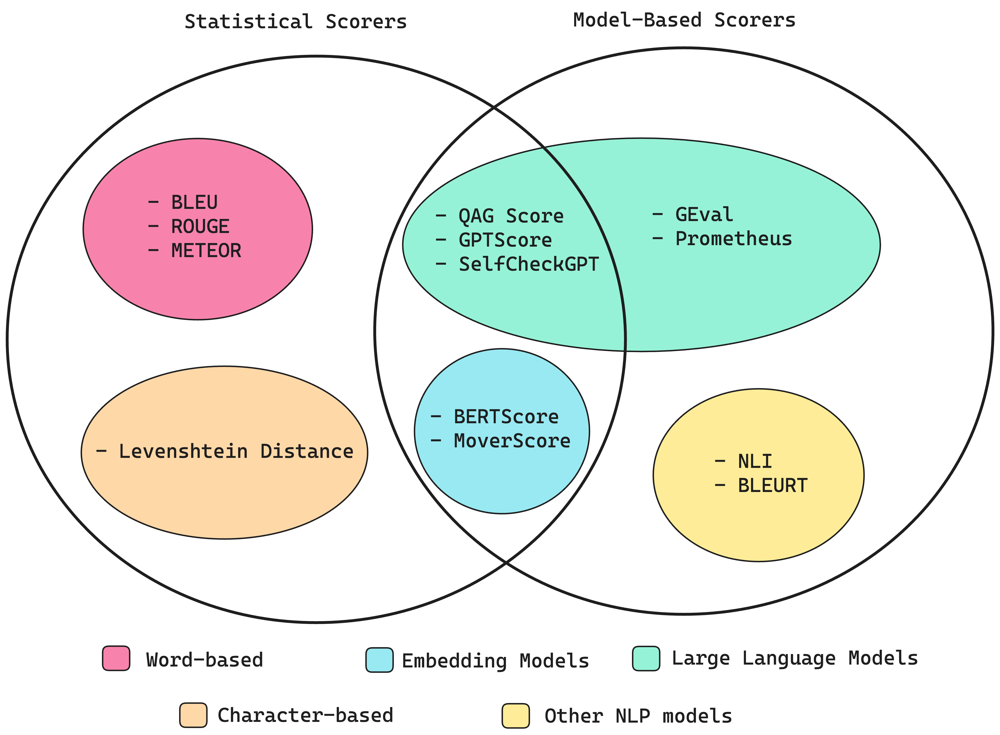
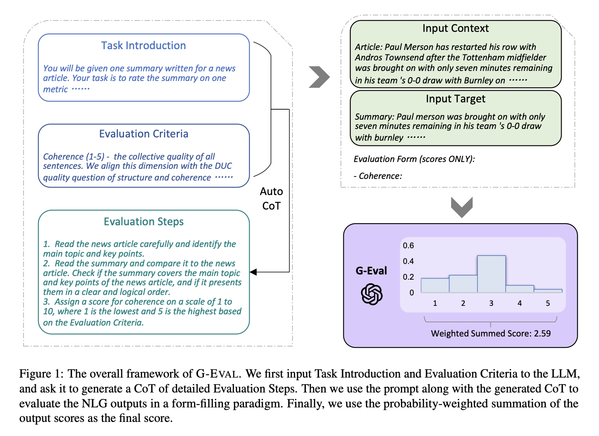

.. _evaluation:

======================
LLM Evaluation Metrics
======================

.. admonition:: Colab Notebook for This Chapter

    GEval with DeepEval: |GEval with DeepEval|

    .. |GEval with DeepEval| image:: images/colab-badge.png 
        :target: https://colab.research.google.com/drive/17aARKonCOzBzsfk1ceLESTboEPkKNJi1?usp=drive_link  

.. _fig_metrics_llm:

    Types of metric scorers (Source: `LLM Evaluation Metrics: The Ultimate LLM Evaluation Guide`_) 

.. _`LLM Evaluation Metrics: The Ultimate LLM Evaluation Guide`: https://www.confident-ai.com/blog/llm-evaluation-metrics-everything-you-need-for-llm-evaluation

Statistical Scorers (Traditional Metrics)
+++++++++++++++++++++++++++++++++++++++++

These metrics evaluate text outputs based on statistical comparisons to references 
or expected outputs.

.. note::

    I completely agree with the author of `LLM Evaluation Metrics: The Ultimate LLM Evaluation Guide`_ 
    that statistical scoring methods are, 
    in my opinion, non-essential to focus on. These methods tend to perform poorly 
    whenever reasoning is required, making them too inaccurate as scorers for 
    most LLM evaluation criteria. Additionally, more advanced metrics, 
    such as GEval :ref:`sec_geval`, provide significantly better alternatives.

- **BLEU (Bilingual Evaluation Understudy):**
  Measures overlap of n-grams between generated and reference texts.
  Common for translation tasks.

- **ROUGE (Recall-Oriented Understudy for Gisting Evaluation):**
  Focuses on recall of n-grams (ROUGE-N), longest common subsequences (ROUGE-L), 
  and skip bigrams (ROUGE-S). Popular in summarization tasks.

- **METEOR (Metric for Evaluation of Translation with Explicit ORdering):**
  Considers synonymy and paraphrasing via stemming and synonym matching.

- **TER (Translation Edit Rate):**
  Measures the number of edits required to turn the generated output into the 
  reference text.

- **CIDEr (Consensus-based Image Description Evaluation):**
  Designed for image captioning, using TF-IDF weighting of n-grams.

- **BERTScore:**
  Leverages contextual embeddings (e.g., BERT) to compute similarity between 
  generated and reference texts.

- **GLEU (Google BLEU):**
  A variation of BLEU designed for grammatical error correction tasks.

Model-Based Scorers (Learned Metrics)
+++++++++++++++++++++++++++++++++++++

These metrics employ models trained to assess the quality of generated text, 
often based on human annotations.

- **BLEURT:**
  Combines pre-trained models (e.g., BERT) with fine-tuning on human judgment data.

- **COMET (Cross-lingual Optimized Metric for Evaluation of Translation):**
  A neural network model trained on translation quality data.

- **PRISM:**
  Measures semantic similarity by paraphrasing both the hypothesis and reference into a shared space.

- **UniEval:**
  A unified framework for evaluation across multiple tasks, focusing on both factual accuracy and linguistic quality.

- **Perplexity:**
  Estimates the likelihood of generated text under the original model's probability distribution (lower is better).

- **GPTScore:**
  Uses a large pre-trained LLM (e.g., GPT-4) to rate the quality of outputs.

- **MAUVE:**
  Measures the divergence between the distribution of generated text and that of human-written text.

- **DRIFT:**
  Focuses on domain-specific evaluation, checking how well outputs align with domain-specific data distributions.

Human-Centric Evaluations (Augmenting Metrics)
++++++++++++++++++++++++++++++++++++++++++++++

While not automated, human evaluations are crucial for assessing subjective qualities such as:

- **Fluency**
- **Coherence**
- **Relevance**
- **Factuality**
- **Style Appropriateness**

Both statistical and model-based scorers are often used in tandem with human evaluation to ensure a holistic assessment of LLM outputs.

.. _sec_geval:

GEval with DeepEval
+++++++++++++++++++

G-Eval is a recently developed evaluation framework developed from paper [GEval]_ to assess large language models (LLMs) using GPT-based evaluators. 
It leverages the capabilities of advanced LLMs (like GPT-4 or beyond) to rate and critique the outputs of other models, including themselves, 
across various tasks. This approach shifts the evaluation paradigm by relying on the intrinsic understanding and reasoning power of the models, 
rather than traditional metrics.

G-Eval Algorithm 
----------------

.. _fig_geval:

    G-Eval Algorithm (Source: [GEval]_) 

G-Eval with DeepEval 
--------------------

In `DeepEval`_,, a metric serves as a standard for measuring the performance 
of an LLM's output based on specific criteria of interest. Essentially, 
while the metric functions as the "ruler", a test case represents the 
subject being measured. `DeepEval`_, provides a variety of default metrics 
to help you get started quickly, including:

    - G-Eval
    - Summarization
    - Faithfulness
    - Answer Relevancy
    - Contextual Relevancy
    - Contextual Precision
    - Contextual Recall
    - Ragas
    - Hallucination
    - Toxicity
    - Bias

DeepEval also provides conversational metrics, designed to evaluate entire 
conversations rather than individual, granular LLM interactions. These include:

    - Conversation Completeness
    - Conversation Relevancy
    - Knowledge Retention

- **Set Up Local Model** 

    .. code-block:: python 
        
        deepeval set-local-model --model-name='mistral' \
        --base-url="http://localhost:11434/v1/" \
        --api-key="ollama"

- **Default Metrics**

    - AnswerRelevancyMetric

        .. code-block:: python 
                
            from deepeval import evaluate
            from deepeval.metrics import AnswerRelevancyMetric
            from deepeval.test_case import LLMTestCase

            answer_relevancy_metric = AnswerRelevancyMetric(threshold=0.7)
            test_case = LLMTestCase(
                input="What if these shoes don't fit?",
                # Replace this with the actual output from your LLM application
                actual_output="We offer a 30-day full refund at no extra costs.",
                retrieval_context=["All customers are eligible for a 30 day full refund at no extra costs."]
            )
            evaluate([test_case], [answer_relevancy_metric])

        - Metrics Summary

            - Answer Relevancy (score: 1.0, threshold: 0.7, strict: False, evaluation model: local model, 
              reason: The score is 1.00 because it directly and accurately answered the question about 
              shoe fitting, making it highly relevant., error: None)

        - For test case:

            - input: What if these shoes don't fit?
            - actual output: We offer a 30-day full refund at no extra costs.
            - expected output: None
            - context: None
            - retrieval context: ['All customers are eligible for a 30 day full refund at no extra costs.']

        - Overall Metric Pass Rates

            Answer Relevancy: 100.00% pass rate

        .. code-block:: python 

            EvaluationResult(test_results=[TestResult(name='test_case_0', success=True, metrics_data=[MetricData(name='Answer Relevancy', threshold=0.7, success=True, score=1.0, reason='The score is 1.00 because it directly and accurately answered the question about shoe fitting, making it highly relevant.', strict_mode=False, evaluation_model='local model', error=None, evaluation_cost=0.0, verbose_logs='Statements:\n[\n    "We offer a 30-day full refund",\n    "The refund does not incur any additional costs"\n] \n \nVerdicts:\n[\n    {\n        "verdict": "yes",\n        "reason": "The statements about the refund policy are relevant to addressing the input, which asks about what to do if the shoes don\'t fit."\n    },\n    {\n        "verdict": "yes",\n        "reason": "The statement that the refund does not incur any additional costs is also relevant as it provides further information about the refund process."\n    }\n]')], conversational=False, multimodal=False, input="What if these shoes don't fit?", actual_output='We offer a 30-day full refund at no extra costs.', expected_output=None, context=None, retrieval_context=['All customers are eligible for a 30 day full refund at no extra costs.'])], confident_link=None)

    - FaithfulnessMetric

        .. code-block:: python 
                
            from deepeval import evaluate
            from deepeval.metrics import FaithfulnessMetric
            from deepeval.test_case import LLMTestCase

            # input 
            input = "What if these shoes don't fit?"

            # Replace this with the actual output from your LLM application
            actual_output = "We offer a 30-day full refund at no extra cost."

            # Replace this with the actual retrieved context from your RAG pipeline
            retrieval_context = ["All customers are eligible for a 30 day full refund at no extra cost."]

            metric = FaithfulnessMetric(
                threshold=0.7,
                #model="gpt-4",
                include_reason=True
            )
            test_case = LLMTestCase(
                input=input,
                actual_output=actual_output,
                retrieval_context=retrieval_context
            )

            metric.measure(test_case)
            print(metric.score)
            print(metric.reason)

            # or evaluate test cases in bulk
            evaluate([test_case], [metric])

        - Metrics Summary

          - Faithfulness (score: 1.0, threshold: 0.7, strict: False, evaluation model: 
            local model, reason: The faithfulness score is 1.00 because there are no 
            contradictions found between the actual output and the retrieval context., error: None)

        - For test case:

            - input: What if these shoes don't fit?
            - actual output: We offer a 30-day full refund at no extra cost.
            - expected output: None
            - context: None
            - retrieval context: ['All customers are eligible for a 30 day full refund at no extra cost.']

        - Overall Metric Pass Rates

            Faithfulness: 100.00% pass rate

        .. code-block:: python 

            EvaluationResult(test_results=[TestResult(name='test_case_0', success=True, metrics_data=[MetricData(name='Faithfulness', threshold=0.7, success=True, score=1.0, reason='The faithfulness score is 1.00 because there are no contradictions found between the actual output and the retrieval context.', strict_mode=False, evaluation_model='local model', error=None, evaluation_cost=0.0, verbose_logs='Truths (limit=None):\n[\n    "Customers are eligible for a 30 day full refund.",\n    "The refund is at no extra cost."\n] \n \nClaims:\n[\n    "The refund is offered for a period of 30 days.",\n    "The refund does not incur any additional costs."\n] \n \nVerdicts:\n[\n    {\n        "verdict": "yes",\n        "reason": null\n    },\n    {\n        "verdict": "yes",\n        "reason": null\n    }\n]')], conversational=False, multimodal=False, input="What if these shoes don't fit?", actual_output='We offer a 30-day full refund at no extra cost.', expected_output=None, context=None, retrieval_context=['All customers are eligible for a 30 day full refund at no extra cost.'])], confident_link=None)

    - ContextualPrecisionMetric

        .. code-block:: python 

            from deepeval import evaluate
            from deepeval.metrics import ContextualPrecisionMetric
            from deepeval.test_case import LLMTestCase

            # input
            input = "What if these shoes don't fit?"

            # Replace this with the actual output from your LLM application
            actual_output = "We offer a 30-day full refund at no extra cost."

            # Replace this with the expected output from your RAG generator
            expected_output = "You are eligible for a 30 day full refund at no extra cost."

            # Replace this with the actual retrieved context from your RAG pipeline
            retrieval_context = ["All customers are eligible for a 30 day full refund at no extra cost."]

            metric = ContextualPrecisionMetric(
                threshold=0.7,
                #model="gpt-4",
                include_reason=True
            )
            test_case = LLMTestCase(
                input=input,
                actual_output=actual_output,
                expected_output=expected_output,
                retrieval_context=retrieval_context
            )

            metric.measure(test_case)
            print(metric.score)
            print(metric.reason)

            # or evaluate test cases in bulk
            evaluate([test_case], [metric])

        - Metrics Summary

            - Contextual Precision (score: 1.0, threshold: 0.7, strict: False, evaluation 
              model: local model, reason: The contextual precision score is 1.00 because 
              the node ranked first (with reason: 'The text verifies that customers are 
              indeed eligible for a 30 day full refund at no extra cost.') is relevant 
              and correctly placed as the highest-ranked response to the input 
              'What if these shoes don't fit?'. All other nodes, if present, 
              should be ranked lower due to their irrelevance to the question., error: None)

        - For test case:

            - input: What if these shoes don't fit?
            - actual output: We offer a 30-day full refund at no extra cost.
            - expected output: You are eligible for a 30 day full refund at no extra cost.
            - context: None
            - retrieval context: ['All customers are eligible for a 30 day full refund at no extra cost.']

        - Overall Metric Pass Rates

            - Contextual Precision: 100.00% pass rate

    - ContextualRecallMetric

        .. code-block:: python 

            from deepeval import evaluate
            from deepeval.metrics import ContextualRecallMetric
            from deepeval.test_case import LLMTestCase

            metric = ContextualRecallMetric(
                threshold=0.7,
                model="gpt-4",
                include_reason=True
            )
            test_case = LLMTestCase(
                input=input,
                actual_output=actual_output,
                expected_output=expected_output,
                retrieval_context=retrieval_context
            )

            metric.measure(test_case)
            print(metric.score)
            print(metric.reason)

            # or evaluate test cases in bulk
            evaluate([test_case], [metric])

        - Metrics Summary

            - Contextual Recall (score: 1.0, threshold: 0.7, strict: False, evaluation 
              model: local model, reason: The score is 1.00 because the expected output 
              is exactly as stated in the retrieval context., error: None)

        - For test case:

            - input: What if these shoes don't fit?
            - actual output: We offer a 30-day full refund at no extra cost.
            - expected output: You are eligible for a 30 day full refund at no extra cost.
            - context: None
            - retrieval context: ['All customers are eligible for a 30 day full refund at no extra cost.']

        - Overall Metric Pass Rates

            - Contextual Recall: 100.00% pass rate

    - HallucinationMetric

        .. code-block:: python 

            from deepeval import evaluate
            from deepeval.metrics import HallucinationMetric
            from deepeval.test_case import LLMTestCase

            # input

            input = "What was the blond doing?"

            # Replace this with the actual documents that you are passing as input to your LLM.
            context=["A man with blond-hair, and a brown shirt drinking out of a public water fountain."]

            # Replace this with the actual output from your LLM application
            actual_output="A blond drinking water in public."

            test_case = LLMTestCase(
                input= input,
                actual_output=actual_output,
                context=context
            )
            metric = HallucinationMetric(threshold=0.5)

            metric.measure(test_case)
            print(metric.score)
            print(metric.reason)

            # or evaluate test cases in bulk
            evaluate([test_case], [metric])

        - Metrics Summary

            - Hallucination (score: 0.0, threshold: 0.5, strict: False, 
              evaluation model: local model, reason: The score is 0.00 because the actual 
              output correctly aligns with the provided context., error: None)

        - For test case:

            - input: What was the blond doing?
            - actual output: A blond drinking water in public.
            - expected output: None
            - context: ['A man with blond-hair, and a brown shirt drinking out of a public water fountain.']
            - retrieval context: None

        - Overall Metric Pass Rates

            Hallucination: 100.00% pass rate

- **Custom Metrics**

    .. code-block:: python 

        from deepeval.metrics import GEval
        from deepeval.test_case import LLMTestCaseParams

        correctness_metric = GEval(
            name="Correctness",
            criteria="Determine whether the actual output is factually correct based on the expected output.",
            # NOTE: you can only provide either criteria or evaluation_steps, and not both
            evaluation_steps=[
                "Check whether the facts in 'actual output' contradicts any facts in 'expected output'",
                "You should also heavily penalize omission of detail",
                "Vague language, or contradicting OPINIONS, are OK"
            ],
            evaluation_params=[LLMTestCaseParams.INPUT, LLMTestCaseParams.ACTUAL_OUTPUT, LLMTestCaseParams.EXPECTED_OUTPUT],
        )

        test_case = LLMTestCase(
            input="The dog chased the cat up the tree, who ran up the tree?",
            actual_output="It depends, some might consider the cat, while others might argue the dog.",
            expected_output="The cat."
        )

        correctness_metric.measure(test_case)
        print(correctness_metric.score)
        print(correctness_metric.reason)

    .. code-block:: python 

        Event loop is already running. Applying nest_asyncio patch to allow async execution...
        0.1
        The actual output does not match the expected output and omits specific details about which animal climbed the tree.

Evaluation Framework:

    .. code-block:: python

        from deepeval import evaluate
        from deepeval.metrics import GEval
        from deepeval.test_case import LLMTestCase
        from deepeval.test_case import LLMTestCaseParams

        correctness_metric = GEval(
            name="Correctness",
            criteria="Determine whether the actual output is factually correct based on the expected output.",
            # NOTE: you can only provide either criteria or evaluation_steps, and not both
            evaluation_steps=[
                "Check whether the facts in 'actual output' contradicts any facts in 'expected output'",
                "You should also heavily penalize omission of detail",
                "Vague language, or contradicting OPINIONS, are OK"
            ],
            evaluation_params=[LLMTestCaseParams.INPUT, LLMTestCaseParams.ACTUAL_OUTPUT, LLMTestCaseParams.EXPECTED_OUTPUT],
        )

        test_case = LLMTestCase(
            input="The dog chased the cat up the tree, who ran up the tree?",
            actual_output="It depends, some might consider the cat, while others might argue the dog.",
            expected_output="The cat."
        )

        evaluate([test_case], [correctness_metric])

    - Metrics Summary

        - Correctness (GEval) (score: 0.2, threshold: 0.5, strict: False, evaluation 
          model: local model, reason: Actual output omits the expected detail (the cat) 
          and contradicts the expected output., error: None)

    - For test case:

        - input: The dog chased the cat up the tree, who ran up the tree?
        - actual output: It depends, some might consider the cat, while others might argue the dog.
        - expected output: The cat.
        - context: None
        - retrieval context: None

    - Overall Metric Pass Rates

        Correctness (GEval): 0.00% pass rate

    .. code-block:: python
        
        EvaluationResult(test_results=[TestResult(name='test_case_0', success=False, metrics_data=[MetricData(name='Correctness (GEval)', threshold=0.5, success=False, score=0.2, reason='Actual output omits the expected detail (the cat) and contradicts the expected output.', strict_mode=False, evaluation_model='local model', error=None, evaluation_cost=0.0, verbose_logs='Criteria:\nDetermine whether the actual output is factually correct based on the expected output. \n \nEvaluation Steps:\n[\n    "Check whether the facts in \'actual output\' contradicts any facts in \'expected output\'",\n    "You should also heavily penalize omission of detail",\n    "Vague language, or contradicting OPINIONS, are OK"\n]')], conversational=False, multimodal=False, input='The dog chased the cat up the tree, who ran up the tree?', actual_output='It depends, some might consider the cat, while others might argue the dog.', expected_output='The cat.', context=None, retrieval_context=None)], confident_link=None)

.. _`DeepEval`: https://docs.confident-ai.com/docs/metrics-introduction 