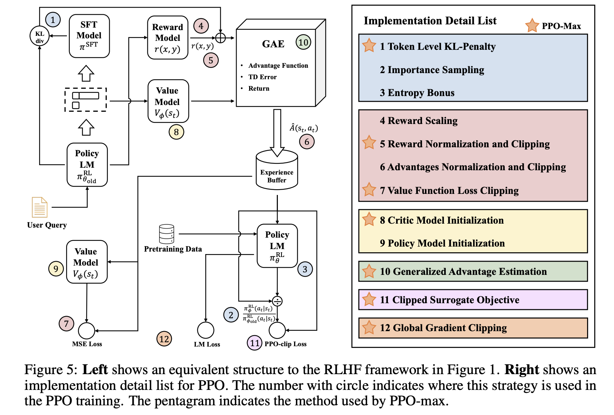

.. _finetuning:

===========
Fine Tuning
===========

.. admonition:: Chinese proverb

	Good tools are prerequisite to the successful execution of a job. – old Chinese proverb

.. admonition:: Colab Notebook for This Chapter

    - Embedding Model Fine-tuning: |e_tune|
    - LLM (Llama 2 7B) Model Fine-tuning: |l_tune|
    
    .. |e_tune| image:: images/colab-badge.png 
        :target: https://colab.research.google.com/drive/14aYT8Ydm_e-z47yGpctAfk246K_PK1LC?usp=drive_link  

    .. |l_tune| image:: images/colab-badge.png 
        :target: https://colab.research.google.com/drive/1GPu2vNRdcObf0dmP7r_M42NYx0OXVD_F?usp=drive_link  

Fine-tuning is a machine learning technique where a pre-trained model (like a large 
language model or neural network) is further trained on a smaller, specific dataset
to adapt it to a particular task or domain. Instead of training a model from scratch, 
fine-tuning leverages the knowledge already embedded in the pre-trained model, 
saving time, computational resources, and data requirements.

.. _fig_fine_tuning:
.. figure:: images/fine_tuning.png
    :align: center

    The three conventional feature-based and finetuning approaches (Souce `Finetuning Sebastian`_).

.. _Finetuning Sebastian: https://magazine.sebastianraschka.com/p/finetuning-large-language-models

Cutting-Edge Strategies for LLM Fine-Tuning
+++++++++++++++++++++++++++++++++++++++++++

Over the past year, fine-tuning methods have made remarkable strides. Modern methods 
for fine-tuning LLMs focus on efficiency, scalability, and resource optimization. 
The following strategies are at the forefront:

LoRA (Low-Rank Adaptation)
--------------------------

**LoRA** reduces the number of trainable parameters by introducing **low-rank decomposition** into the fine-tuning process.

.. _fig_lora:
.. figure:: images/lora.png
    :align: center

    Weight update matrix (Souce `LORA Sebastian`_).

.. _LORA Sebastian: https://magazine.sebastianraschka.com/p/practical-tips-for-finetuning-llms

**How It Works**:  

- Instead of updating all model weights, LoRA injects **low-rank adapters** into the model’s layers.  
- The original pre-trained weights remain frozen; only the low-rank parameters are optimized.

**Benefits**:  

- Reduces memory and computational requirements.  
- Enables fine-tuning on resource-constrained hardware.

QLoRA (Quantized Low-Rank Adaptation)
-------------------------------------

**QLoRA** combines **low-rank adaptation** with **4-bit quantization** of the pre-trained model.

**How It Works**:  

- The LLM is quantized to **4-bit precision** to reduce memory usage.  
- LoRA adapters are applied to the quantized model for fine-tuning.  
- Precision is maintained using methods like **NF4 (Normalized Float 4)** and double backpropagation.

**Benefits**:  

- Further reduces memory usage compared to LoRA.  
- Enables fine-tuning of massive models on consumer-grade GPUs.

PEFT (Parameter-Efficient Fine-Tuning)
--------------------------------------

**PEFT** is a general framework for fine-tuning LLMs with minimal trainable parameters.

.. list-table::
   :width: 100%
   :class: borderless

   * - .. image:: images/peft_1.png
        :width: 100%
            
     - .. image:: images/peft_2.png
        :width: 100%

Source: [PEFT]_ 

**Techniques Under PEFT**:

- **LoRA**: Low-rank adaptation of weights.  
- **Adapters**: Small trainable layers inserted into the model.  
- **Prefix Tuning**: Fine-tuning input prefixes instead of weights.  
- **Prompt Tuning**: Optimizing soft prompts in the input space.

**Benefits**:  

- Reduces the number of trainable parameters.  
- Faster training and lower hardware requirements.

SFT (Supervised Fine-Tuning)
----------------------------

**SFT** adapts an LLM using a labeled dataset in a fully supervised manner.

**How It Works**:  

- The model is initialized with pre-trained weights.  
- It is fine-tuned on a task-specific dataset with a supervised loss function (e.g., cross-entropy).

**Benefits**:  

- Achieves high performance on specific tasks.  
- Essential for aligning models with labeled datasets.

RLHF (Reinforcement Learning from Human Feedback)
-------------------------------------------------

**RLHF** is a technique used to fine-tune language models, aligning their 
behavior with human preferences or specific tasks. RLHF incorporates feedback 
from humans to guide the model's learning process, ensuring that its outputs 
are not only coherent but also align with desired ethical, practical, or 
stylistic goals.

**How It Works**:  

- The model is initialized with pre-trained weights.  
- The pretrained model is fine-tuned further using reinforcement learning, 
  guided by the reward model.
- A reinforcement learning algorithm, such as Proximal Policy Optimization 
  (PPO), optimizes the model to maximize the reward assigned by the reward model.

.. note::

    - **Direct Preference Optimization** 
        DPO is a technique for aligning large 
        language models (LLMs) with human preferences, offering an alternative 
        to the traditional Reinforcement Learning from Human Feedback (RLHF) 
        approach that uses Proximal Policy Optimization (PPO). Instead of 
        training a separate reward model and using reinforcement learning, 
        DPO simplifies the process by directly leveraging human preference 
        data to fine-tune the model through supervised learning.

    - **Proximal Policy Optimization** 
        PPO is a reinforcement learning algorithm 
        commonly used in RLHF to fine-tune LLMs. PPO optimizes the model's policy 
        by maximizing the reward signal provided by a reward model, which 
        represents human preferences.

    - **Comparison: DPO vs PPO**

        +---------------------------+-----------------------------------------+----------------------------------------+
        | **Feature**               | **DPO**                                 | **PPO**                                |
        +===========================+=========================================+========================================+
        | **Training Paradigm**     | Supervised fine-tuning with preferences | Reinforcement learning with a reward   |
        |                           |                                         | model                                  |
        +---------------------------+-----------------------------------------+----------------------------------------+
        | **Workflow Complexity**   | Simpler                                 | More complex (requires reward model    |
        |                           |                                         | and iterative RL)                      |
        +---------------------------+-----------------------------------------+----------------------------------------+
        | **Stability**             | More stable (uses supervised learning)  | Less stable (inherent to RL methods)   |
        +---------------------------+-----------------------------------------+----------------------------------------+
        | **Efficiency**            | Computationally efficient               | Computationally intensive              |
        +---------------------------+-----------------------------------------+----------------------------------------+
        | **Scalability**           | Scales well with large preference       | Requires significant compute for RL    |
        |                           | datasets                                | steps                                  |
        +---------------------------+-----------------------------------------+----------------------------------------+
        | **Use Case**              | Directly aligns LLM with preferences    | Optimizes policy for long-term reward  |
        |                           |                                         | maximization                           |
        +---------------------------+-----------------------------------------+----------------------------------------+
        | **Human Preference        | Directly encoded in loss function       | Encoded via a reward model             |
        | Modeling**                |                                         |                                        |
        +---------------------------+-----------------------------------------+----------------------------------------+        

**Benefits**:  

- RLHF ensures the model's outputs are ethical, safe, and aligned with human 
  expectations, reducing harmful or biased content. 
- Responses become more relevant, helpful, and contextually appropriate, 
  enhancing user experience.
- Fine-tuning with RLHF allows models to be customized for specific use cases, 
  such as customer service, creative writing, or technical support.

The process of training a model using reinforcement learning from human
feedback (RLHF) involves three key steps, as outlined in the paper
titled “`Training language models to follow instructions with human
feedback <https://arxiv.org/abs/2203.02155>`__” by OpenAI [LongOuyang]_.

.. figure:: images/instructGPT_overview_RLHF.png
   :alt: instructGPT_overview_RLHF
   :align: center

   InstructGPT Overview (Source: `Training language models to follow instructions with human feedback <https://arxiv.org/abs/2203.02155>`__)

PPO
~~~

Proximal Policy Optimization (PPO) (Paper: `Proximal Policy Optimization
Algorithms <https://arxiv.org/abs/1707.06347>`__) is a key algorithm
used in RLHF to fine-tune language models based on human preferences. It
is utilized to optimize the policy of a language model by maximizing a
reward function derived from human feedback. This process helps align
the model’s outputs with human values and preferences. [JohnSchulman]_

**State, Action, and Reward in the Context of LLMs**

In the context of LLMs, the components of reinforcement learning are
defined as follows:

1. **State**: The state corresponds to the **input prompt** or context
   provided to the language model. It represents the scenario or query
   that requires a response.
2. **Action**: The action is the **output** generated by the language
   model, i.e., the response or continuation of text based on the given
   state (prompt).
3. **Reward**: The reward is a scalar value that quantifies how well the
   generated response aligns with human preferences or task objectives.
   It is typically derived from a **reward model** trained on human
   feedback.
4. **Policy**: A policy refers to the strategy or function that maps a
   given state (input prompt and context) to an action (the next token
   or sequence of tokens to generate). The policy governs how the LLM
   generates responses and is optimized to maximize a reward signal,
   such as alignment with human preferences or task-specific objectives.

**Proximal Policy Optimization (PPO)** is a reinforcement learning
algorithm designed to optimize the policy of an agent in a stable and
efficient manner. It is particularly effective in environments with
discrete or continuous action spaces. Here’s an overview of PPO along
with its objective function:

**PPO Objective Function**

PPO algorithm extends the CLIP objective by incorporating additional
terms for value function optimization and entropy regularization.

.. math::

   J^{PPO}(\theta) = E[J^{CLIP}(\theta) - c_1(V_\theta(s)-V_{target})^2 + c_2 H(s,\pi_\theta(\cdot))]

where

- :math:`J^{CLIP}(\theta)` is CLIP objective in policy gradient methods.
  The use of the minimum function ensures that if the new policy’s
  probability ratio deviates too much from 1 (indicating a significant
  change), it will not receive excessive credit (or blame) for its
  performance based on the advantage estimate.

  .. math::

     J^{CLIP}(\theta) = E[\min(r(\theta)\hat{A}_{\theta_{old}}(s,a)), \text{clip}(r(\theta),1-\epsilon, 1+\epsilon) \hat{A}_{\theta_{old}}(s,a)]

- :math:`-(V_\theta(s) - V_{target})^2` is the negative mean squared
  error (MSE), which we aim to maximize. It minimizes the difference
  between the predicted value function :math:`V_\theta(s)` and the
  target value :math:`V_{target}`. The coefficient :math:`c_2` controls
  the tradeoff between policy optimization and value function fitting.

- :math:`H(s,\pi_\theta(\cdot))` represents the entropy of the policy.
  Maximizing entropy encourages exploration by preventing premature
  convergence to deterministic policies. The coefficient :math:`c_2`
  determines the weight of this entropy term.

Below is a pseudocode of PPO-Clip Algorithm 

.. figure:: images/ppo_clip_algo.png
   :alt: ppo_clip_algo
   :align: center

   PPO Clip Algorithm (Source: `OpenAI Spinning Up - Proximal Policy Optimization <https://spinningup.openai.com/en/latest/algorithms/ppo.html>`__)

**Steps of RLHF Using PPO**

The RLHF process using PPO involves three main stages:

1. **Training a Reward Model**: A reward model is trained to predict
   human preferences based on labeled data. Human annotators rank
   multiple responses for each prompt, and this ranking data is used to
   train the reward model in a supervised manner. The reward model
   learns to assign higher scores to responses that align better with
   human preferences.

2. **Fine-Tuning the LLM with PPO**: After training the reward model,
   PPO is used to fine-tune the LLM. The steps are as follows:

   1. **Initialize Policies**: Start with a pre-trained LLM as both the
      **policy model** (actor) and optionally as the critic for value
      estimation.

      - The **actor** is the language model that generates responses
        (actions) based on input prompts (states).

        For example: Input: “Explain quantum mechanics.” Output:
        “Quantum mechanics is a branch of physics that studies particles
        at atomic and subatomic scales.”

      - The **critic** is typically implemented as a **value function**,
        which predicts how good a particular response (action) is in
        terms of achieving long-term objectives. This model predicts a
        scalar value for each token or sequence, representing its
        expected reward or usefulness.

        For example:

        Input: “Explain quantum mechanics.” → “Quantum mechanics is…”
        Output: A value score indicating how well this response aligns
        with human preferences or task objectives.

      - Both the actor and critic can be initialized from the same
        pre-trained LLM weights to leverage shared knowledge from
        pretraining. However, their roles diverge during fine-tuning:
        The actor focuses on generating responses. The critic focuses on
        evaluating those responses.

   2. **Collect Rollouts**: Interact with the environment by sampling
      prompts from a dataset. Generate responses (actions) using the
      current policy. Compute rewards for these responses using the
      trained reward model.

   3. **Compute Advantage Estimates**: Use rewards from the reward model
      and value estimates from the critic to compute advantages:

      .. math::

         \hat{A}(s, a) = R_t + \gamma V(s_{t+1}) - V(s_t),

      where $ R_t $ is the reward from the reward model.

   4. **Optimize Policy with PPO Objective**: Optimize the policy using
      PPO’s clipped surrogate objective:

      .. math::

         J^{CLIP}(\theta) = \mathbb{E}\left[\min\left(r(\theta)\hat{A}(s, a), \text{clip}(r(\theta), 1-\epsilon, 1+\epsilon)\hat{A}(s, a)\right)\right],

      where $ r(\theta) = \frac{\pi_\theta(a|s)}{\pi_{\theta_{\text{old}}}(a|s)}
      $ is the probability ratio between new and old policies.

   5. **Update Value Function**: Simultaneously update the value
      function by minimizing mean squared error between predicted values
      and rewards:

      .. math::

         \mathcal{L}_{\text{value}} = \mathbb{E}\left[(V_\theta(s) - R_t)^2\right].

   6. **Repeat**: Iterate over multiple epochs until convergence,
      ensuring stable updates by clipping policy changes.

3. **Evaluation**: Evaluate the fine-tuned LLM on unseen prompts to
   ensure it generates outputs aligned with human preferences.
   Optionally, collect additional human feedback to further refine both
   the reward model and policy.

The following diagrams summarizes the high-level RLHF process with PPO,
from preference data creation, to training a reward model, and using
reward model in an RL loop to fine tune LLM.

   Flowchart of PPO in RLHF

The following workflow chart illustrates the more detailed training
process of RLHF with PPO. [RuiZheng]_ 

.. figure:: images/RLHF_training_realworld.png
   :alt: RLHF_training_realworld
   :align: center

   RLHF Training Workflow (Source: `Secrets of RLHF in Large Language Models Part I PPO <https://arxiv.org/abs/2307.04964>`__)

**RLHF Training Tricks**

There are practical challenges that arise during RLHF training. These
challenges stem from the inherent complexities of RL, especially when
applied to aligning LLMs with human preferences. Therefore, tricks are
essential for addressing the practical limitations of RLHF, ensuring the
training process remains efficient, stable, and aligned with human
preferences while minimizing the impact of inherent challenges in RL
systems. 

   RLHF Training Tricks (Source: `Secrets of RLHF in Large Language Models Part I 
   PPO <https://arxiv.org/abs/2307.04964>`__)

DPO
~~~

The main reason why RLHF with PPO is hard is that it takes a lot of
redundant effort. Policy Model is all we need, all other efforts are not
necessary. **DPO (Direct Preference Optimization)** is a novel
alternative to traditional RLHF for fine-tuning LLMs. It simplifies the
RLHF process by eliminating the need for complex reward models and RL
algorithms. Instead, DPO reframes the problem of aligning LLMs with
human preferences as a classification problem using human-labeled
preference data. [RafaelRafailov]_

The main idea is DPO and difference between DPO and PPO are shown in the
figure below 

   DPO Idea in the Paper (Source: `Direct Preference Optimization Your Language Model is Secretly a Reward Model <https://arxiv.org/abs/2305.18290>`__)

**DPO Objective**

**RLHF objective** is defined as follows. Keep in mind that no matter
whether DPO or PPO is used, the objective is always like this.

.. math::

   \max_{\pi_\theta} E_{x \sim D, y \sim \pi_\theta(y|x)}\Big[r_{\phi}(x,y) - \beta D_{KL}\big[\pi_\theta(y|x) || \pi_{ref}(y|x)\big]\Big]

where :math:`\beta D_{KL}\big[\pi_\theta(y|x) || \pi_{ref}(y|x)\big]` is
a regularization term. When applying RL to NLP, regularization is often
needed. Otherwise RL would explore every possible situation and find out
hidden tricks which deviate from a language model.

**DPO’s objective function** is derived by incoroprating the probability
of preference from reward function of optimal policy. DPO paper has
provided detailed steps of deriving the gradient of the DPO objective:[RafaelRafailov]_

.. math::

   L_{DPO}(\pi_\theta; \pi_{ref}) = -E_{(x,y_w,y_l) \sim D} \Big[\log \sigma \Big(\beta \log {\pi_{\theta}(y_w|x)\over \pi_{ref}(y_w|x)} - \beta \log {\pi_{\theta}(y_l|x)\over \pi_{ref}(y_l|x)}\Big)\Big)\Big]

**Key ideas of DPO objective**:

- DPO’s objective aims to increase the likelihood of generating
  preferred responses over less preferred ones. By focusing directly on
  preference data, DPO eliminates the need to first fit a reward model
  that predicts scalar rewards based on human preferences. This
  simplifies the training pipeline and reduces computational overhead.
- Value functions exist to help reduce the variance of the reward model.
  In DPO, the value function is not involved because DPO does not rely
  on a traditional RL framework, such as Actor-Critic methods. Instead,
  DPO directly optimizes the policy using human preference data as a
  **classification task**, skipping the intermediate steps of training a
  reward model or estimating value functions.
- DPO was originally designed to work with **pairwise** preference data,
  however, recent advancements and adaptations have extended its
  applicability to ranking preference data as well (e.g RankDPO).

.. code:: python

   import torch.nn.functional as F

   def dpo_loss(pi_logps, ref_logps, yw_idxs, yl_idxs, beta):
       """
       pi_logps: policy logprobs, shape (B,)
       ref_logps: reference model logprobs, shape (B,)
       yw_idxs: preferred completion indices in [0, B-1], shape (T,)
       yl_idxs: dispreferred completion indices in [0, B-1], shape (T,)
       beta: temperature controlling strength of KL penalty

       Each pair of (yw_idxs[i], yl_idxs[i]) represents the
       indices of a single preference pair.
       """

       pi_yw_logps, pi_yl_logps = pi_logps[yw_idxs], pi_logps[yl_idxs]
       ref_yw_logps, ref_yl_logps = ref_logps[yw_idxs], ref_logps[yl_idxs]

       pi_logratios = pi_yw_logps - pi_yl_logps
       ref_logratios = ref_yw_logps - ref_yl_logps

       losses = -F.logsigmoid(beta * (pi_logratios - ref_logratios))
       rewards = beta * (pi_logps - ref_logps).detach()

       return losses, rewards

**Steps of RLHF Using DPO**

**1. Initial Setup and Supervised Fine-Tuning (SFT)**: Begin by
fine-tuning a pre-trained LLM using supervised learning on a dataset
that is representative of the tasks the model will perform. This step
ensures the model has a strong foundation in the relevant domain,
preparing it for preference-based optimization.

**2. Collect Preference Data**: Gather human feedback in the form of
pairwise preferences or rankings. Annotators evaluate responses
generated by the model and indicate which ones they prefer. Construct a
dataset of prompts and corresponding preferred and less-preferred
responses.

**3. Iterative Rounds of DPO**

- **Sampling and Annotation**: In each round, sample a set of responses
  from the model for given prompts. Collect new preference annotations
  based on these samples, allowing for dynamic updates to the preference
  dataset. (Public preference data works as well. Off-policy and
  on-policy data both work).

- **Preference Optimization**: Use DPO to adjust the model’s outputs
  based on collected preference data:

- **Model Update**: Fine-tune the model using this loss function to
  increase the likelihood of generating preferred responses.

**4. Evaluation and Iteration**

- **Performance Assessment**: After each round, evaluate the model’s
  performance on new prompts to ensure it aligns with human preferences.
  Use feedback from these evaluations to inform subsequent rounds of
  sampling and optimization.

- **Iterative Refinement**: Continue this loop process over multiple
  rounds, iteratively refining the model’s alignment with human
  preferences through continuous sampling and preference optimization.

**DPO Variants**

The key area of research involves developing variants of DPO and
conducting theoretical analyses to understand its limitations and
potential improvements. This includes exploring different loss functions
or optimization strategies that can be applied within the DPO framework.

- One significant area of research focuses on refining the loss function
  used in DPO. This includes exploring ways to eliminate the need for a
  reference model, which can simplify the optimization process.

  Examples:

  - `ORPO: Monolithic Preference Optimization without Reference
    Model <https://arxiv.org/abs/2403.07691>`__

  - `SimPO: Simple Preference Optimization with a Reference-Free
    Reward <https://arxiv.org/abs/2405.14734>`__

- Another key direction involves leveraging existing supervised
  fine-tuning data as preference data for DPO. This strategy aims to
  enhance the quality of preference data by utilizing high-quality
  labeled datasets that may already exist from previous SFT processes.

  Examples:

  - `Refined Direct Preference Optimization with Synthetic Data for
    Behavioral Alignment of LLMs <https://arxiv.org/abs/2402.08005v1>`__

Main Difficulties in RLHF
~~~~~~~~~~~~~~~~~~~~~~~~~

**Data Collection**

In practice, people noticed that the collection of human feedback in the
form of the preference dataset is a slow manual process that needs to be
repeated whenever alignment criteria change. And there is increasing
difficulty in annotating preference data as models become more advanced,
particularly because distinguishing between outputs becomes more nuanced
and subjective.

- The paper “`CDR: Customizable Density Ratios of Strong-over-weak LLMs
  for Preference Annotation <https://arxiv.org/abs/2411.02481>`__”
  explains that as models become more advanced, it becomes harder to
  identify which output is better due to subtle differences in quality.
  This makes preference data annotation increasingly difficult and
  subjective.
- Another paper, “`Improving Context-Aware Preference Modeling for
  Language Models <https://arxiv.org/abs/2407.14916>`__,” discusses how
  the underspecified nature of natural language and multidimensional
  criteria make direct preference feedback difficult to interpret. This
  highlights the challenge of providing consistent annotations when
  outputs are highly sophisticated and nuanced.
- “`Less for More: Enhancing Preference Learning in Generative Language
  Models <https://www.arxiv.org/abs/2408.12799>`__” also notes that
  ambiguity among annotators leads to inconsistently annotated datasets,
  which becomes a greater issue as model outputs grow more complex.

**Reward Hacking**

Reward hacking is a common problem in reinforcement learning, where the
agent learns to exploit the system by maximizing its reward through
actions that deviate from the intended goal. In the context of RLHF,
reward hacking occurs when training settles in an unintended region of
the loss landscape. In this scenario, the model generates responses that
achieve high reward scores, but these responses may fail to be
meaningful or useful to the user.

In PPO, reward hacking occurs when the model exploits flaws or
ambiguities in the **reward model** to achieve high rewards without
genuinely aligning with human intentions. This is because PPO relies on
a learned reward model to guide policy updates, and any inaccuracies or
biases in this model can lead to unintended behaviors being rewarded.
PPO is particularly vulnerable to reward hacking if the reward model is
not robustly designed or if it fails to capture the true objectives of
human feedback. The iterative nature of PPO, which involves continuous
policy updates based on reward signals, can exacerbate this issue if not
carefully managed.

DPO avoids explicit reward modeling by directly optimizing policy based
on preference data. However, it can still encounter issues similar to
reward hacking if the preference data is **biased** or if the
optimization process leads to **overfitting** specific patterns in the
data that do not generalize well. While DPO does not suffer from reward
hacking in the traditional sense (since it lacks a separate reward
model), it can still find biased solutions that exploit
**out-of-distribution responses** or deviate from intended behavior due
to distribution shifts between training and deployment contexts.

- The article “`Reward Hacking in Reinforcement
  Learning <https://lilianweng.github.io/posts/2024-11-28-reward-hacking/>`__”
  by Lilian Weng discusses how reward hacking occurs when a RL agent
  exploits flaws or ambiguities in the reward function to achieve high
  rewards without genuinely learning the intended task. It highlights
  that in RLHF for language models, reward hacking is a critical
  challenge, as models might learn to exploit unit tests or mimic biases
  to achieve high rewards, which can hinder real-world deployment.
- The research “`Scaling Laws for Reward Model
  Overoptimization <https://arxiv.org/abs/2210.10760>`__” explores how
  optimizing against reward models trained to predict human preferences
  can lead to overoptimization, hindering the actual objective.

  1. **Impact of Policy Model Size**: Holding the RM size constant,
     experiments showed that larger policy models exhibited similar
     overoptimization trends as smaller models, despite achieving higher
     initial gold scores. This implies that their higher performance on
     gold rewards does not lead to excessive optimization pressure on
     the RM.
  2. **Relationship with RM Data Size**: Data size had a notable effect
     on RM performance and overoptimization. Models trained on fewer
     than ~2,000 comparison labels showed near-chance performance, with
     limited improvement in gold scores. Beyond this threshold, all RMs,
     regardless of size, benefited from increased data, with larger RMs
     showing greater improvements in gold rewards compared to smaller
     ones.
  3. **Scaling Laws for RM Parameters and Data Size**: Overoptimization
     patterns scaled smoothly with both RM parameter count and data
     size. Larger RMs demonstrated better alignment with gold rewards
     and less susceptibility to overoptimization when trained on
     sufficient data, indicating improved robustness.
  4. **Proxy vs. Gold Reward Trends**: For small data sizes, proxy
     reward scores deviated significantly from gold reward scores,
     highlighting overoptimization risks. As data size increased, the
     gap between proxy and gold rewards narrowed, reducing
     overoptimization effects.

Note that the KL divergence term in the RLHF objective is intended to
prevent the policy from deviating too much from a reference model,
thereby maintaining stability during training. However, it does not
fully prevent reward hacking. Reward hacking occurs when an agent
exploits flaws or ambiguities in the reward model to achieve high
rewards without genuinely aligning with human intentions. The KL
divergence penalty does not correct these flaws in the reward model
itself, meaning that if the reward model is misaligned, the agent can
still find ways to exploit it. KL does not directly address whether the
actions align with the true objectives or desired outcomes.

Summary Table
-------------

+-------------------+---------------------------------------------+--------------------------------------------+
| **Method**        | **Description**                             | **Key Benefit**                            |
+-------------------+---------------------------------------------+--------------------------------------------+
| **LoRA**          | Low-rank adapters for parameter-efficient   | Reduces trainable parameters significantly.|
|                   | tuning.                                     |                                            |
+-------------------+---------------------------------------------+--------------------------------------------+
| **QLoRA**         | LoRA with 4-bit quantization of the model.  | Fine-tunes massive models on smaller       |
|                   |                                             | hardware.                                  |
+-------------------+---------------------------------------------+--------------------------------------------+
| **PEFT**          | General framework for efficient fine-tuning.| Includes LoRA, Adapters, Prefix Tuning,    |
|                   |                                             | etc.                                       |
+-------------------+---------------------------------------------+--------------------------------------------+
| **SFT**           | Supervised fine-tuning with labeled data.   | High performance on task-specific datasets |
+-------------------+---------------------------------------------+--------------------------------------------+

These strategies represent the forefront of **LLM fine-tuning**, offering efficient and scalable solutions for 
real-world applications. To choose the most suitable strategy, consider the following factors:

- **Resource-Constrained Environments**: Use **LoRA** or **QLoRA**.  
- **Large-Scale Models**: **QLoRA** for low-memory fine-tuning.  
- **High Performance with Labeled Data**: **SFT**.  
- **Minimal Setup**: **Zero-shot** or **Few-shot** learning.  
- **General Efficiency**: Use **PEFT** frameworks.

Key Early Fine-Tuning Methods
+++++++++++++++++++++++++++++

Early fine-tuning methods laid the foundation for current approaches. These methods 
primarily focused on updating the entire model or selected components.

Full Fine-Tuning
----------------

All the parameters of a pre-trained model are updated using task-specific data :ref:`fig_fine_tuning` (right).

**How It Works**:  

- The pre-trained model serves as the starting point.  
- Fine-tuning is conducted on a smaller, labeled dataset using a supervised loss function.  
- A low learning rate is used to prevent **catastrophic forgetting**.

**Benefits**:  

- Effective at adapting models to specific tasks.  

**Challenges**:  

- Computationally expensive.  
- Risk of overfitting on small datasets.

Feature-Based Approach
----------------------

The pre-trained model is used as a **feature extractor**, while only a task-specific head is trained :ref:`fig_fine_tuning` (left).

**How It Works**:  

- The model processes inputs and extracts features (embeddings).  
- A separate classifier (e.g., linear or MLP) is trained on top of these features.  
- The pre-trained model weights remain **frozen**.

**Benefits**:  

- Computationally efficient since only the task-specific head is trained.  

Layer-Specific Fine-Tuning
--------------------------

Only certain layers of the pre-trained model are fine-tuned while the rest remain frozen :ref:`fig_fine_tuning` (middle).

**How It Works**:  

- Earlier layers (which capture general features) are frozen.  
- Later layers (closer to the output) are fine-tuned on task-specific data.  

**Benefits**:  

- Balances computational efficiency and task adaptation.  

Task-Adaptive Pre-training
--------------------------

Before fine-tuning on a specific task, the model undergoes additional **pre-training** on a domain-specific corpus.

**How It Works**: 

- A general pre-trained model is further pre-trained (unsupervised) on domain-specific data.  
- Fine-tuning is then performed on the downstream task.

**Benefits**:  

- Provides a better starting point for domain-specific tasks.  

Embedding Model Fine-Tuning
+++++++++++++++++++++++++++

In the chapter :ref:`rag`, we discussed how embedding models are crucial for the success of RAG applications. 
However, their general-purpose training often limits their effectiveness for company- or domain-specific 
use cases. Customizing embeddings with domain-specific data can significantly improve the retrieval 
performance of your RAG application.

In this chapter, we will demonstrate how to fine-tune embedding models using the 
``SentenceTransformersTrainer``, building on insights shared in the blog [fineTuneEmbedding]_ and 
Sentence Transformer `Training Overview`_. Our main contribution was introducing LoRA to enable functionality on 
NVIDIA T4 GPUs, while the rest of the pipeline and code remained almost unchanged.

.. _`Training Overview`: https://sbert.net/docs/sentence_transformer/training_overview.html#dataset-format

.. note::

    Please ensure that the package versions are set as follows:
    
    .. code-block:: python 

        pip install  "torch==2.1.2" tensorboard
        
        pip install --upgrade \
            sentence-transformers>=3 \
            datasets==2.19.1  \
            transformers==4.41.2 \
            peft==0.10.0

    Otherwise, you may encounter the error.  

Prepare Dataset
---------------

We are going to directly use the synthetic dataset ``philschmid/finanical-rag-embedding-dataset``, which includes 7,000 
positive text pairs of questions and corresponding context from the `2023_10 NVIDIA SEC Filing`_.

.. _2023_10 NVIDIA SEC Filing: https://stocklight.com/stocks/us/nasdaq-nvda/nvidia/annual-reports/nasdaq-nvda-2023-10K-23668751.pdf

.. code-block:: python 

    from datasets import load_dataset

    # Load dataset from the hub
    dataset = load_dataset("philschmid/finanical-rag-embedding-dataset", split="train")

    # rename columns
    dataset = dataset.rename_column("question", "anchor")
    dataset = dataset.rename_column("context", "positive")

    # Add an id column to the dataset
    dataset = dataset.add_column("id", range(len(dataset)))

    # split dataset into a 10% test set
    dataset = dataset.train_test_split(test_size=0.1)

    # save datasets to disk
    dataset["train"].to_json("train_dataset.json", orient="records")
    dataset["test"].to_json("test_dataset.json", orient="records")    

.. note::

    In practice, most dataset configurations will take one of four forms:

    - **Positive Pair**: A pair of related sentences. This can be used both for symmetric tasks
      (semantic textual similarity) or asymmetric tasks (semantic search), with examples 
      including pairs of paraphrases, pairs of full texts and their summaries, pairs of 
      duplicate questions, pairs of ``(query, response)``, or pairs of 
      ``(source_language, target_language)``. 
      Natural Language Inference datasets can also be formatted this way by pairing entailing sentences.
    - **Triplets**: ``(anchor, positive, negative)`` text triplets. These datasets don't need labels.
    - **Pair with Similarity Score**: A pair of sentences with a score indicating their similarity. 
      Common examples are "Semantic Textual Similarity" datasets.
    - **Texts with Classes**: A text with its corresponding class. This data format is easily 
      converted by loss functions into three sentences (triplets) where the first is an "anchor", 
      the second a "positive" of the same class as the anchor, and the third a "negative" of a different class.

    Note that it is often simple to transform a dataset from one format to another, such that it works with 
    your loss function of choice.

Import and Evaluate Pretrained Baseline Model
---------------------------------------------

.. code-block:: python 

    import torch
    from sentence_transformers import SentenceTransformer
    from sentence_transformers.evaluation import (
        InformationRetrievalEvaluator,
        SequentialEvaluator,
    )
    from sentence_transformers.util import cos_sim
    from datasets import load_dataset, concatenate_datasets
    from peft import LoraConfig, TaskType

    model_id =  "BAAI/bge-base-en-v1.5"
    matryoshka_dimensions = [768, 512, 256, 128, 64] # Important: large to small

    # Load a model
    model = SentenceTransformer(
        model_id,
        trust_remote_code=True,
        device="cuda" if torch.cuda.is_available() else "cpu"
    )

    # load test dataset
    test_dataset = load_dataset("json", data_files="test_dataset.json", split="train")
    train_dataset = load_dataset("json", data_files="train_dataset.json", split="train")
    corpus_dataset = concatenate_datasets([train_dataset, test_dataset])

    # Convert the datasets to dictionaries
    corpus = dict(
        zip(corpus_dataset["id"], corpus_dataset["positive"])
    )  # Our corpus (cid => document)
    queries = dict(
        zip(test_dataset["id"], test_dataset["anchor"])
    )  # Our queries (qid => question)

    # Create a mapping of relevant document (1 in our case) for each query
    relevant_docs = {}  # Query ID to relevant documents (qid => set([relevant_cids])
    for q_id in queries:
        relevant_docs[q_id] = [q_id]

    matryoshka_evaluators = []
    # Iterate over the different dimensions
    for dim in matryoshka_dimensions:
        ir_evaluator = InformationRetrievalEvaluator(
            queries=queries,
            corpus=corpus,
            relevant_docs=relevant_docs,
            name=f"dim_{dim}",
            truncate_dim=dim,  # Truncate the embeddings to a certain dimension
            score_functions={"cosine": cos_sim},
        )
        matryoshka_evaluators.append(ir_evaluator)

    # Create a sequential evaluator
    evaluator = SequentialEvaluator(matryoshka_evaluators)

.. note::

   If you encounter the error ``Cannot import name 'EncoderDecoderCache' from 'transformers'``, 
   ensure that the package versions are set to ``peft==0.10.0`` and ``transformers==4.37.2``.

.. code-block:: python 

    # Evaluate the model
    results = evaluator(model)

    # Print the main score
    for dim in matryoshka_dimensions:
        key = f"dim_{dim}_cosine_ndcg@10"
        print
        print(f"{key}: {results[key]}")

.. code-block:: python        

    dim_768_cosine_ndcg@10: 0.754897248109794
    dim_512_cosine_ndcg@10: 0.7549275773474213
    dim_256_cosine_ndcg@10: 0.7454714780163237
    dim_128_cosine_ndcg@10: 0.7116728650043451
    dim_64_cosine_ndcg@10: 0.6477174937632066

Loss Function with Matryoshka Representation
--------------------------------------------

.. code-block:: python   

    from sentence_transformers import SentenceTransformerModelCardData, SentenceTransformer

    # Hugging Face model ID: https://huggingface.co/BAAI/bge-base-en-v1.5
    model_id = "BAAI/bge-base-en-v1.5"

    # load model with SDPA for using Flash Attention 2
    model = SentenceTransformer(
        model_id,
        model_kwargs={"attn_implementation": "sdpa"},
        model_card_data=SentenceTransformerModelCardData(
            language="en",
            license="apache-2.0",
            model_name="BGE base Financial Matryoshka",
        ),
    )

    # Apply PEFT with PromptTuningConfig
    peft_config = LoraConfig(
        task_type=TaskType.FEATURE_EXTRACTION,
        inference_mode=False,
        r=8,
        lora_alpha=32,
        lora_dropout=0.1,
    )
    model.add_adapter(peft_config, "dense")

    # train loss
    from sentence_transformers.losses import MatryoshkaLoss, MultipleNegativesRankingLoss

    matryoshka_dimensions = [768, 512, 256, 128, 64]  # Important: large to small
    inner_train_loss = MultipleNegativesRankingLoss(model)
    train_loss = MatryoshkaLoss(model,
                                inner_train_loss,
                                matryoshka_dims=matryoshka_dimensions)

.. note::

    Loss functions play a critical role in the performance of your fine-tuned model. 
    Sadly, there is no "one size fits all" loss function. Ideally, 
    this table should help narrow down your choice of loss function(s) by matching 
    them to your data formats.

    You can often convert one training data format into another, allowing more loss 
    functions to be viable for your scenario. For example, 

    
    +---------------------------------------------------+--------------------------------+---------------------------------------------------------------------------------------------------------------------+
    | Inputs                                            | Labels                         | Appropriate Loss Functions                                                                                          |                                                                                                                                                                                                                                                                                                                                                                                                                                                                                                                                                                                                                                                                       
    +===================================================+================================+=====================================================================================================================+
    |``single sentences``                               | `class`                        | ``BatchAllTripletLoss``, ``BatchHardSoftMarginTripletLoss``, ``BatchHardTripletLoss``, ``BatchSemiHardTripletLoss`` |
    +---------------------------------------------------+--------------------------------+---------------------------------------------------------------------------------------------------------------------+
    |``single sentences``                               | `none`                         | ``ContrastiveTensionLoss``, ``DenoisingAutoEncoderLoss``                                                            |                                                                                                                                                                                                                                                                                                                                                                                                                                                                                                              
    +---------------------------------------------------+--------------------------------+---------------------------------------------------------------------------------------------------------------------+
    |``(anchor, anchor)`` pairs                         | `none`                         | ``ContrastiveTensionLossInBatchNegatives``                                                                          |                                                                                                                                                                                                                                                                                                                                                                                                                                                                                                                                                                    
    +---------------------------------------------------+--------------------------------+---------------------------------------------------------------------------------------------------------------------+
    |``(damaged_sentence, original_sentence)`` pairs    | `none`                         | ``DenoisingAutoEncoderLoss``                                                                                        |                                                                                                                                                                                                                                                                                                                                                                                                                                                                                                                                                                                                           
    +---------------------------------------------------+--------------------------------+---------------------------------------------------------------------------------------------------------------------+
    |``(sentence_A, sentence_B)`` pairs                 | `class`                        | ``SoftmaxLoss``                                                                                                     |                                                                                                                                                                                                                                                                                                                                                                                                                                                                                                                                                                                                                      
    +---------------------------------------------------+--------------------------------+---------------------------------------------------------------------------------------------------------------------+
    |``(anchor, positive)`` pairs                       | `none`                         | ``MultipleNegativesRankingLoss``, ``CachedMultipleNegativesRankingLoss``, ``MultipleNegativesSymmetricRankingLoss``,| 
    |                                                   |                                | ``CachedMultipleNegativesSymmetricRankingLoss``, ``MegaBatchMarginLoss``, ``GISTEmbedLoss``, ``CachedGISTEmbedLoss``|
    +---------------------------------------------------+--------------------------------+---------------------------------------------------------------------------------------------------------------------+
    |``(anchor, positive/negative)`` pairs              | `1 if positive, 0 if negative` | ``ContrastiveLoss``, ``OnlineContrastiveLoss``                                                                      |                                                                                                                                                                                                                                                                                                                                                                                                                                                                                                                                                                                                                                      
    +---------------------------------------------------+--------------------------------+---------------------------------------------------------------------------------------------------------------------+
    |``(sentence_A, sentence_B)`` pairs                 | `float similarity score`       | ``CoSENTLoss``, ``AnglELoss``, ``CosineSimilarityLoss``                                                             |                                                                                                                                                                                                                                                                                                                                                                                                                                                                                                                                                                  
    +---------------------------------------------------+--------------------------------+---------------------------------------------------------------------------------------------------------------------+
    |``(anchor, positive, negative)`` triplets          | `none`                         | ``MultipleNegativesRankingLoss``, ``CachedMultipleNegativesRankingLoss``, ``TripletLoss``,                          |
    |                                                   |                                | ``CachedGISTEmbedLoss``, ``GISTEmbedLoss``                                                                          |                                                                                                                                                                                                                                                           
    +---------------------------------------------------+--------------------------------+---------------------------------------------------------------------------------------------------------------------+
    |`(anchor, positive, negative_1, ..., negative_n)`` | `none`                         | ``MultipleNegativesRankingLoss``, ``CachedMultipleNegativesRankingLoss``, ``CachedGISTEmbedLoss``                   |                                                                                                                                                                                                                                                                                                                                                                                                                                                                                                     
    +---------------------------------------------------+--------------------------------+---------------------------------------------------------------------------------------------------------------------+

Fine-tune Embedding Model 
-------------------------

.. code-block:: python  

    from sentence_transformers import SentenceTransformerTrainingArguments
    from sentence_transformers.training_args import BatchSamplers

    # load train dataset again
    train_dataset = load_dataset("json", data_files="train_dataset.json", split="train")

    # define training arguments
    args = SentenceTransformerTrainingArguments(
        output_dir=output_dir, # output directory and hugging face model ID
        num_train_epochs=4,                         # number of epochs
        per_device_train_batch_size=32,             # train batch size
        gradient_accumulation_steps=16,             # for a global batch size of 512
        per_device_eval_batch_size=16,              # evaluation batch size
        warmup_ratio=0.1,                           # warmup ratio
        learning_rate=2e-5,                         # learning rate, 2e-5 is a good value
        lr_scheduler_type="cosine",                 # use constant learning rate scheduler
        optim="adamw_torch_fused",                  # use fused adamw optimizer
        tf32=False,                                  # use tf32 precision
        bf16=False,                                  # use bf16 precision
        batch_sampler=BatchSamplers.NO_DUPLICATES,  # MultipleNegativesRankingLoss benefits from no duplicate samples in a batch
        eval_strategy="epoch",                      # evaluate after each epoch
        save_strategy="epoch",                      # save after each epoch
        logging_steps=10,                           # log every 10 steps
        save_total_limit=3,                         # save only the last 3 models
        load_best_model_at_end=True,                # load the best model when training ends
        metric_for_best_model="eval_dim_128_cosine_ndcg@10",  # Optimizing for the best ndcg@10 score for the 128 dimension
        greater_is_better=True,                     # maximize the ndcg@10 score
    )

    from sentence_transformers import SentenceTransformerTrainer

    trainer = SentenceTransformerTrainer(
        model=model, # bg-base-en-v1
        args=args,  # training arguments
        train_dataset=train_dataset.select_columns(
            ["anchor", "positive"]
        ),  # training dataset
        loss=train_loss,
        evaluator=evaluator,
    )

    # start training
    trainer.train()

    # save the best model
    #trainer.save_model()
    trainer.model.save_pretrained("bge-base-finetuning")

Evaluate Fine-tuned Model
-------------------------

.. code-block:: python  

    from sentence_transformers import SentenceTransformer

    fine_tuned_model = SentenceTransformer(
        'bge-base-finetuning', device="cuda" if torch.cuda.is_available() else "cpu"
    )
    # Evaluate the model
    results = evaluator(fine_tuned_model)

    # # COMMENT IN for full results
    # print(results)

    # Print the main score
    for dim in matryoshka_dimensions:
        key = f"dim_{dim}_cosine_ndcg@10"
        print(f"{key}: {results[key]}")

.. code-block:: python  

    dim_768_cosine_ndcg@10: 0.7650276801072632
    dim_512_cosine_ndcg@10: 0.7603951540556889
    dim_256_cosine_ndcg@10: 0.754743133407988
    dim_128_cosine_ndcg@10: 0.7205317098443929
    dim_64_cosine_ndcg@10: 0.6609117856061502
        
Results Comparison
------------------

Although we did not observe the significant performance boost reported in the original 
blog, the fine-tuned model outperformed the baseline model across all dimensions using 
only 6.3k samples and partial parameter fine-tuning. MOre details can be found as follows:

+-----------+----------+------------+-------------+
| Dimension | Baseline | Fine-tuned | Improvement |
+===========+==========+============+=============+
| 768       | 0.75490  | 0.76503    | 1.34%       |
+-----------+----------+------------+-------------+
| 512       | 0.75492  | 0.76040    | 0.73%       |
+-----------+----------+------------+-------------+
| 256       | 0.74547  | 0.75474    | 1.24%       |
+-----------+----------+------------+-------------+
| 128       | 0.71167  | 0.72053    | 1.24%       |
+-----------+----------+------------+-------------+
| 64        | 0.64772  | 0.66091    | 2.04%       |
+-----------+----------+------------+-------------+

.. _fig_wandb:
.. figure:: images/fine_tuning_wandb.png
    :align: center

    Epoch, Training Loss/steps in Wandb

LLM Fine-Tuning
+++++++++++++++

In this chapter, we will demonstrate how to fine-tune a Llama 2 model with 7 billion parameters using 
a T4 GPU with 16 GB of VRAM. Due to VRAM limitations, traditional fine-tuning is not feasible, 
making parameter-efficient fine-tuning (PEFT) techniques like LoRA or QLoRA essential. For this 
demonstration, we use QLoRA, which leverages 4-bit precision to significantly reduce VRAM consumption.

The folloing code is from notebook [fineTuneLLM]_, and the copyright belongs to the original author.

Load Dataset and Pretrained Model 
---------------------------------

.. code-block:: python  

    # Step 1 : Load dataset (you can process it here)
    dataset = load_dataset(dataset_name, split="train")

    # Step 2 :Load tokenizer and model with QLoRA configuration
    compute_dtype = getattr(torch, bnb_4bit_compute_dtype)

    bnb_config = BitsAndBytesConfig(
        load_in_4bit=use_4bit,
        bnb_4bit_quant_type=bnb_4bit_quant_type,
        bnb_4bit_compute_dtype=compute_dtype,
        bnb_4bit_use_double_quant=use_nested_quant,
    )

    # Step 3 :Check GPU compatibility with bfloat16
    if compute_dtype == torch.float16 and use_4bit:
        major, _ = torch.cuda.get_device_capability()
        if major >= 8:
            print("=" * 80)
            print("Your GPU supports bfloat16: accelerate training with bf16=True")
            print("=" * 80)

    # Step 4 :Load base model
    model = AutoModelForCausalLM.from_pretrained(
        model_name,
        quantization_config=bnb_config,
        device_map=device_map
    )
    model.config.use_cache = False
    model.config.pretraining_tp = 1

    # Step 5 :Load LLaMA tokenizer
    tokenizer = AutoTokenizer.from_pretrained(model_name, trust_remote_code=True)
    tokenizer.add_special_tokens({'pad_token': '[PAD]'})
    tokenizer.pad_token = tokenizer.eos_token
    tokenizer.padding_side = "right"    

Fine-tuning Configuration
-------------------------

.. code-block:: python  
        
    # Step 6 :Load LoRA configuration
    peft_config = LoraConfig(
        lora_alpha=lora_alpha,
        lora_dropout=lora_dropout,
        r=lora_r,
        bias="none",
        task_type="CAUSAL_LM",
    )

    # Step 7 :Set training parameters
    training_arguments = TrainingArguments(
        output_dir=output_dir,
        num_train_epochs=num_train_epochs,
        per_device_train_batch_size=per_device_train_batch_size,
        gradient_accumulation_steps=gradient_accumulation_steps,
        optim=optim,
        save_steps=save_steps,
        logging_steps=logging_steps,
        learning_rate=learning_rate,
        weight_decay=weight_decay,
        fp16=fp16,
        bf16=bf16,
        max_grad_norm=max_grad_norm,
        max_steps=max_steps,
        warmup_ratio=warmup_ratio,
        group_by_length=group_by_length,
        lr_scheduler_type=lr_scheduler_type,
        report_to="tensorboard"
    )

Fine-tune model
---------------

.. code-block:: python  

    # Step 8 :Set supervised fine-tuning parameters
    trainer = SFTTrainer(
        model=model,
        train_dataset=dataset,
        peft_config=peft_config,
        dataset_text_field="text",
        max_seq_length=max_seq_length,
        tokenizer=tokenizer,
        args=training_arguments,
        packing=packing,
    )

    # Step 9 :Train model
    trainer.train()

    # Step 10 :Save trained model
    trainer.model.save_pretrained(new_model)

.. _fig_fine_tuning_llm:
.. figure:: images/fine_tuning_llm.png
    :align: center

    Llama 2 Model Fine-Tuning TensorBoard

