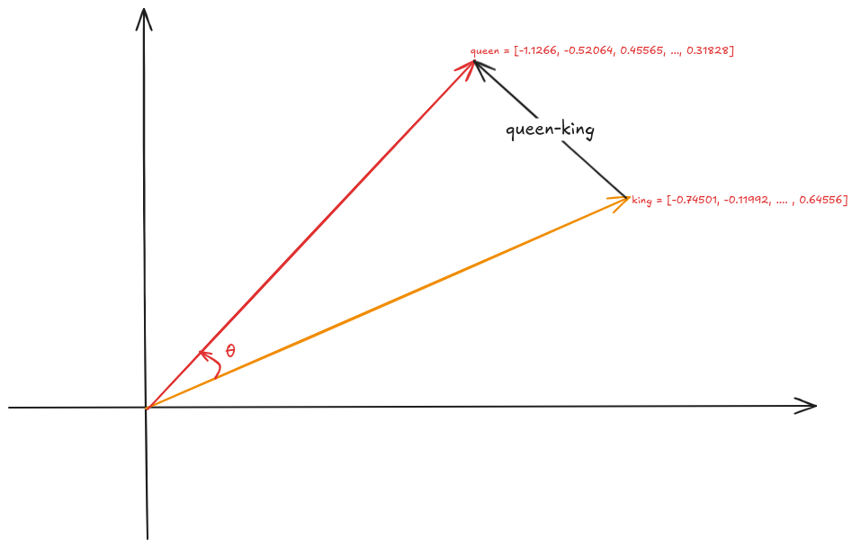
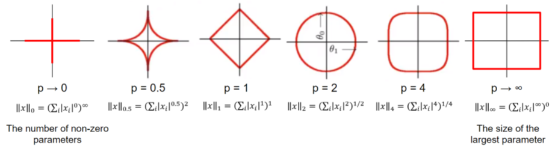

.. _prelim:

===========
Preliminary
===========

In this chapter, we will introduce some math and NLP preliminaries which is highly
used in Generative AI. 

Math Preliminary
++++++++++++++++

Vector 
------

A vector is a mathematical representation of data that has both magnitude and direction. 
Each data point is represented as a feature vector, where each component of the vector 
corresponds to a specific feature or attribute of the data.

.. code-block:: python 

    import numpy as np
    import gensim.downloader as api
    # Download pre-trained GloVe model
    glove_vectors = api.load("glove-twitter-25")

    # Get word vectors (embeddings)
    word1 = "king"
    word2 = "queen"

    # embedding
    king = glove_vectors[word1]
    queen = glove_vectors[word2]

    print('king:\n', king)
    print('queen:\n', queen)

.. code-block:: python 

    king:
    [-0.74501  -0.11992   0.37329   0.36847  -0.4472   -0.2288    0.70118
    0.82872   0.39486  -0.58347   0.41488   0.37074  -3.6906   -0.20101
    0.11472  -0.34661   0.36208   0.095679 -0.01765   0.68498  -0.049013
    0.54049  -0.21005  -0.65397   0.64556 ]
    queen:
    [-1.1266   -0.52064   0.45565   0.21079  -0.05081  -0.65158   1.1395
    0.69897  -0.20612  -0.71803  -0.02811   0.10977  -3.3089   -0.49299
    -0.51375   0.10363  -0.11764  -0.084972  0.02558   0.6859   -0.29196
    0.4594   -0.39955  -0.40371   0.31828 ]

.. _fig_logo:

    Vector 

Norm
----

Norm is a function that maps a vector to a single positive value, representing its 
magnitude. Norms are used to calculate distances between vectors, which is vital 
for measuring prediction errors in models, performing feature
selection, and applying regularization techniques.

.. _fig_logo:

    Geometrical Interpretation of Norm (`source_1`_)

.. _source_1: https://math.stackexchange.com/questions/805954/what-does-the-dot-product-of-two-vectors-represent

- Formula:

    The :math:`\displaystyle \ell^p` norm for :math:`\vec{v} = (v_1, v_2, \cdots, v_n)` is

    .. math::
        ||\vec{v}||_p = \sqrt[p]{|v_1|^p + |v_2|^p + \cdots +|v_n|^p } 

- :math:`\displaystyle \ell^1` norm: Sum of absolute values of vector components, often used for feature selection due to its tendency to produce sparse solutions. 

    .. code-block:: python

        # l1 norm 
        np.linalg.norm(king,ord=1) #	max(sum(abs(x), axis=0))

        ### 13.188952

- :math:`\displaystyle \ell^2` norm: Square root of the sum of squared vector components, the most common norm used in many machine learning algorithms. 

    .. code-block:: python

        # l2 norm 
        np.linalg.norm(king,ord=2)

        ### 4.3206835

- :math:`\displaystyle \ell^\infty` norm (Maximum norm): The largest absolute value of a vector component. 

Distances
---------

- Manhattan Distance (:math:`\displaystyle \ell^1` Distance)

    Also known as taxicab or city block distance, Manhattan distance measures the absolute differences between the components of two vectors. It calculates the distance a point would travel along the grid lines in a Cartesian plane, as if navigating through a city.

    For two vector :math:`\vec{u} = (u_1, u_2, \cdots, u_n)` and :math:`\vec{v} = (v_1, v_2, \cdots, v_n)`, the 
    Manhattan Distance distance :math:`d(\vec{u},\vec{v})` is
    
    .. math:: 
        d(\vec{u},\vec{v}) = ||\vec{u}-\vec{v}||_1 = |u_1-v_1| + |u_2-v_2|+ \cdots +|u_n-v_n|

- Euclidean Distance (:math:`\displaystyle \ell^2` Distance)

    Euclidean distance is the most common way to measure the distance between two points (vectors) in space. It is essentially the straight-line distance between them, calculated using the Pythagorean theorem.

    For two vector :math:`\vec{u} = (u_1, u_2, \cdots, u_n)` and :math:`\vec{v} = (v_1, v_2, \cdots, v_n)`, the Euclidean Distance distance :math:`d(\vec{u},\vec{v})` is
    
    .. math::

        d(\vec{u},\vec{v}) = ||\vec{u}-\vec{v}||_2 = \sqrt{(u_1-v_1)^2 + (u_2-v_2)^2+ \cdots +(u_n-v_n)^2}

- Minkowski Distance (:math:`\displaystyle \ell^p` Distance)

    Minkowski distance is a generalization of both Euclidean and Manhattan distances. It introduces a parameter :math:`p` that allows you to adjust the sensitivity of the distance metric.

- Cos Similarity

    Cosine similarity measures the angle between two vectors rather than their straight-line distance. It is used to determine how similar two vectors are by focusing on their orientation rather than their magnitude. This makes it particularly useful for high-dimensional data, such as text, where the magnitude of the vectors may not be as important as the direction.

    The Cos similarity for two vector :math:`\vec{u} = (u_1, u_2, \cdots, u_n)` and :math:`\vec{v} = (v_1, v_2, \cdots, v_n)` is

    .. math::

        cos(\theta) = \frac{\vec{u}\cdot\vec{v}}{||\vec{u}|| ||\vec{v}||}

    - 1 means the vectors point in exactly the same direction (perfect similarity).
    - 0 means they are orthogonal (no similarity).
    - -1 means they point in opposite directions (complete dissimilarity).

    .. code-block:: python

        # Compute cosine similarity between the two word vectors
        np.dot(king,queen)/(np.linalg.norm(king)*np.linalg.norm(queen))
        
        ### 0.92024213

    .. code-block:: python   

        # Compute cosine similarity between the two word vectors
        similarity = glove_vectors.similarity(word1, word2)
        print(f"Word vectors for '{word1}': {king}")
        print(f"Word vectors for '{word2}': {queen}")
        print(f"Cosine similarity between '{word1}' and '{word2}': {similarity}")             

    .. code-block:: python   

        Word vectors for 'king': [-0.74501  -0.11992   0.37329   0.36847  -0.4472   -0.2288    0.70118
        0.82872   0.39486  -0.58347   0.41488   0.37074  -3.6906   -0.20101
        0.11472  -0.34661   0.36208   0.095679 -0.01765   0.68498  -0.049013
        0.54049  -0.21005  -0.65397   0.64556 ]
        Word vectors for 'queen': [-1.1266   -0.52064   0.45565   0.21079  -0.05081  -0.65158   1.1395
        0.69897  -0.20612  -0.71803  -0.02811   0.10977  -3.3089   -0.49299
        -0.51375   0.10363  -0.11764  -0.084972  0.02558   0.6859   -0.29196
        0.4594   -0.39955  -0.40371   0.31828 ]
        Cosine similarity between 'king' and 'queen': 0.920242190361023

NLP Preliminary
+++++++++++++++

Vocabulary
----------

Tagging
-------

Lemmatization
-------------

Tokenization
------------

Out-of-vocabulary tokens 
Subword Tokenization 

Platform and Packages
+++++++++++++++++++++

