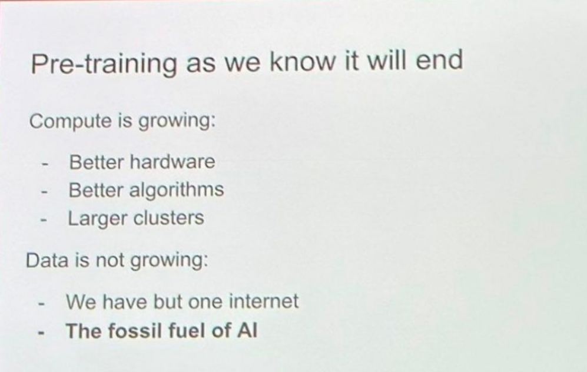

.. _pretraining:

============
Pre-training 
============

.. admonition:: Proverb

	Pre-training as we know it will end. – Ilya Sutskever at neurips 2024

.. _fig_ilya:

    Ilya Sutskever at neurips 2024

In industry, most companies focus primarily on prompt engineering, RAG, and fine-tuning, 
while advanced techniques like pre-training from scratch or deep model customization 
remain less common due to the significant resources and expertise required. 

LLMs, like GPT (Generative Pre-trained Transformer), BERT (Bidirectional Encoder 
Representations from Transformers), and others, are large-scale models built using 
the transformer architecture. These models are trained on vast amounts of text data to 
learn patterns in language, enabling them to generate human-like text, answer questions, 
summarize information, and perform other natural language processing tasks.

This chapter delves into transformer models, drawing on insights from 
`The Annotated Transformer`_ and `Tracing the Transformer in Diagrams`_, to explore their underlying architecture and practical applications.    

.. _`The Annotated Transformer`: https://nlp.seas.harvard.edu/annotated-transformer/
.. _`Tracing the Transformer in Diagrams`: https://towardsdatascience.com/tracing-the-transformer-in-diagrams-95dbeb68160c
