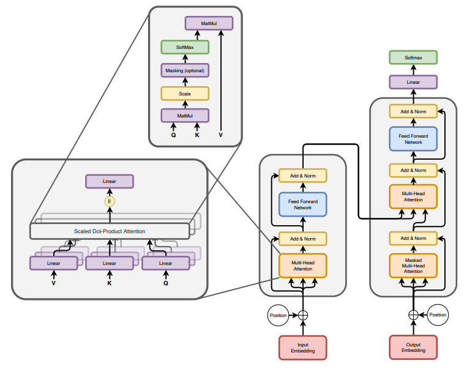

.. _pretraining:

============
Pre-training 
============

.. admonition:: Ilya Sutskever at Neurips 2024

   .. _fig_ilya:
   .. figure:: images/ilya_sutskever.png
      :align: center

In industry, most companies focus primarily on prompt engineering, RAG, and fine-tuning, 
while advanced techniques like pre-training from scratch or deep model customization 
remain less common due to the significant resources and expertise required. 

LLMs, like GPT (Generative Pre-trained Transformer), BERT (Bidirectional Encoder 
Representations from Transformers), and others, are large-scale models built using 
the transformer architecture. These models are trained on vast amounts of text data to 
learn patterns in language, enabling them to generate human-like text, answer questions, 
summarize information, and perform other natural language processing tasks.

This chapter delves into transformer models, drawing on insights from 
`The Annotated Transformer`_ and `Tracing the Transformer in Diagrams`_, to explore their 
underlying architecture and practical applications.    

.. _`The Annotated Transformer`: https://nlp.seas.harvard.edu/annotated-transformer/
.. _`Tracing the Transformer in Diagrams`: https://towardsdatascience.com/tracing-the-transformer-in-diagrams-95dbeb68160c

Transformer Architecture
===========================

   Transformer Architecture (source: [attentionAllYouNeed]_)

Attention Is All You Need
-------------------------

The Transformer is a deep learning model designed to handle sequential
data, such as text, by relying entirely on attention mechanisms rather
than recurrence or convolution. It consists of an **encoder-decoder
structure**, where the **encoder** transforms an input sequence into a
set of rich contextual representations, and the **decoder** generates
the output sequence by attending to these representations and previously
generated tokens. Both encoder and decoder are composed of stacked
layers, each featuring **multi-head self-attention** (to capture
relationships between tokens), **feedforward neural networks** (for
non-linear transformations), and **residual connections with layer
normalization** (to improve training stability). Positional encodings
are added to token embeddings to retain sequence order information, and
the architecture’s parallelism and scalability make it highly efficient
for tasks like machine translation, summarization, and language
modeling.

When the Transformer architecture was introduced in the paper
*“Attention Is All You Need”* (Vaswani et al., 2017), the primary task
it aimed to address was **machine translation**. The researchers wanted
to develop a model that could translate text from one language to
another more efficiently and effectively than the existing
sequence-to-sequence (Seq2Seq) models, which relied heavily on recurrent
neural networks (RNNs) or long short-term memory (LSTM) networks. RNNs /
LSTMs suffer from slow training and inference, short-term memory, and
vanishing / exploding gradients challenges, due to their sequentual
nature and long-range dependencies. The Transformer with self-attention
mechanism achieved to eliminate the sequential bottleneck of RNNs while
retaining the ability to capture dependencies across the entire input
sequence.

Encoder-Decoder
---------------

Transformer has an encoding component, a decoding component, and
connections between them. The encoding component is a stack of encoders
- usually 6-12 layers, though it can go higher (e.g. T5-large has 24
encoder layers). The decoder component is a stack of decoders, usually
in the same number of layers for balance.

- Each **encoder** layer includes multi-head self-attention, feedforward
  neural network (FNN), add & norm, and positional encoding. It reads
  the input sequence (e.g., a sentence in Chinese) and produces a
  context-aware representation.

- Each **decoder** layer includes masked multi-head self-attention,
  encoder-decoder attention, feedforward neural network (FFN), add &
  norm, and positional encoding. It generates the output sequence (e.g.,
  a translation in English) using the encoder’s output and previously
  generated tokens.

The encoder-decoder structure was inspired by earlier Seq2Seq models
(Sutskever et al., 2014), which used separate RNNs or LSTMs for encoding
the input sequence and decoding the output sequence. The innovation of
the Transformer was replacing the recurrent nature of those models with
an attention-based approach. The Transformer revolutionized not just
machine translation but also the entire field of natural language
processing (NLP). Its encoder-decoder structure provided a blueprint for
subsequent models:

- **Encoder-only models** (e.g., BERT, RoBERTa, DistilBERT) for
  understanding tasks such as classification, sentiment analysis, named
  entity recognition, and question answering.

  - Unlike encoder-decoder or decoder-only models, encoder-only models
    don’t generate new sequences. Its architecture and training
    objectives are optimized for extracting contextual representations
    from input sequences. They focus solely on understanding and
    representing the input.
  - Encoder-only models typically use **bidirectional self-attention**,
    meaning each token can attend to all other tokens in the sequence
    (both before and after it). This contrasts with decoder-only models,
    which use causal masking and can only attend to past tokens.
    Bidirectionality provides a more holistic understanding of the
    input.
  - Encoder-only models are often pretrained with tasks like **masked
    language modeling (MLM)**, where random tokens in the input are
    masked and the model learns to predict them based on context.

- **Decoder-only models** (e.g., GPT series, Transformer-XL) for text
  generation tasks.

  - Decoder-only models are trained with an **autoregressive
    objective**, meaning they predict the next token in a sequence based
    on the tokens seen so far. This makes them inherently suited for
    producing coherent, contextually relevant continuations.
  - The self-attention mechanism in decoder-only models is **causal**,
    meaning each token attends only to previous tokens (including
    itself). They are pretrained with **causal language modeling
    (CLM)**, where they learn to predict the next token given the
    previous ones.
  - Decoder-only models are not constrained to fixed-length outputs and
    can generate sequences of arbitrary lengths, making them ideal for
    open-ended tasks such as story writing, dialogue generation, and
    summarization.

- **Encoder-decoder models** (e.g., Original Transformer, BART, T5) for
  sequence-to-sequence tasks such as machine translation, summarization,
  and text generation.

  - Encoder and decoder are designed to handle different parts of the
    task - creating a contextual representation and generating output
    sequence. This decoupling of encoding and decoding allows the model
    to flexibly handle inputs and outputs of different lengths.
  - The **encoder-decoder attention mechanism** in the decoder allows
    the model to focus on specific parts of the encoded input sequence
    while generating the output sequence. This **cross-attention**
    mechanism helps maintain the relationship between the input and
    output sequences.
  - In many encoder-decoder models (such as those based on
    Transformers), the encoder processes the input sequence
    **bidirectionally**, meaning it can attend to both preceding and
    succeeding tokens when creating the representations. This ensures a
    comprehensive understanding of the input sequence before it is
    passed to the decoder.
  - During training, the encoder-decoder model is typically provided
    with a sequence of **input-output pairs** (e.g., a Chinese sentence
    and its English translation). This paired structure makes the model
    highly suited for tasks like translation, where the goal is to map
    input sequences in one language to corresponding output sequences in
    another language.

Positional Encoding
-------------------

**Positional encoding** is a mechanism used in transformers to provide
information about the order of tokens in a sequence. Unlike recurrent
neural networks (RNNs), transformers process all tokens in parallel, and
therefore lack a built-in way to capture sequential information.
Positional encoding solves this by injecting position-dependent
information into the input embeddings.

Sinusoidal Positional Encodings
~~~~~~~~~~~~~~~~~~~~~~~~~~~~~~~

Sinusoidal positional encoding adds a vector to the embedding of each
token, with the vector values derived using **sinusoidal functions**.
For a token at position :math:`pos` in the sequence and a specific
dimension :math:`i` of the embedding:

.. math::

   PE(pos,2i) = \sin\Big({pos\over 10000^{2i/d}}\Big)\\
   PE(pos,2i+1) = \cos\Big({pos\over 10000^{2i/d}}\Big)

where

- :math:`pos`: Position of the token in the sequence.
- :math:`i`: Index of the embedding dimension.
- :math:`d`: Total dimension of the embedding vector.

The positional encodings are added directly to the token embeddings:

.. math::

   \text{Input to Transformer} = \text{Token Embedding} + \text{Positional Encoding}

.. figure:: images/position_embedding.png
   :alt: position_embedding
   :align: center

   Positional Embedding

Rotary Positional Embeddings (RoPE)
~~~~~~~~~~~~~~~~~~~~~~~~~~~~~~~~~~~

Rotary positional embedding is a modern variant that introduces
positional information through rotation in a complex vector space. It
encodes positional information by rotating the query and key vectors in
the attention mechanism using a transformation in a complex vector
space. RoPE mitigates the limitations of absolute positional encodings
by focusing on relative relationships, enabling smooth transitions and
better handling of long sequences. This makes it particularly
advantageous in large-scale language models like GPT-4, LLaMA, where
long-range dependencies and adaptability are crucial.

Given a token vector :math:`x` with positional encoding, RoPE applies a
rotation:

.. math::

   \text{RoPE} = R(pos)\cdot x

where :math:`R(pos)` is the rotation matrix determined by the token’s
position.

Specifically, for a rotation by an angle :math:`\theta`, the 2D rotation
matrix is

.. math::

   R(\theta) = \begin{bmatrix} \cos(\theta) & -\sin(\theta) \\ \sin(\theta) & \cos(\theta)\end{bmatrix}

For each pair of dimensions :math:`(x_{even}, x_{odd})`, the rotation is
performed as

.. math::

   \begin{bmatrix}x'_{even} \\x'_{odd} \end{bmatrix} = \begin{bmatrix} \cos(\theta) & -\sin(\theta) \\ \sin(\theta) & \cos(\theta)\end{bmatrix} \cdot \begin{bmatrix}x_{even} \\x_{odd} \end{bmatrix}

**Learnable Positional Encodings**
~~~~~~~~~~~~~~~~~~~~~~~~~~~~~~~~~~

Learnable Positional Encodings are a type of positional encoding used in
transformer-based models where the positional information is not fixed
(like in **sinusoidal** encoding) but is **learned during training**.
These encodings are treated as trainable parameters and are updated
through backpropagation, just like other parameters in the model.

Summary
~~~~~~~

+---------------+---------------------+---------------------+---------------------+
| Feature       | Sinusoidal          | Rotary Positional   | Learnable           |
|               | Positional Encoding | Embeddings (RoPE)   | Positional          |
|               |                     |                     | Encodings           |
+===============+=====================+=====================+=====================+
| Type          | Absolute            | Relative            | Absolute            |
+---------------+---------------------+---------------------+---------------------+
| Learnable     | No                  | No                  | Yes                 |
+---------------+---------------------+---------------------+---------------------+
| Advantages    | Fixed, no trainable | Encodes relative    | Flexible for        |
|               | parameters;         | positional          | task-specific       |
|               | Generalizes to      | relationships;      | adaptation;         |
|               | unseen sequence     | Scales efficiently  | Optimized during    |
|               | lengths;            | to long sequences;  | training.           |
|               | Computationally     | Smooth handling of  |                     |
|               | simple.             | long-range          |                     |
|               |                     | dependencies.       |                     |
+---------------+---------------------+---------------------+---------------------+
| Disadvantages | Fixed, cannot adapt | More complex to     | Limited to a fixed  |
|               | to data; Encodes    | implement;          | maximum sequence    |
|               | only absolute       | Relatively new,     | length; No inherent |
|               | positions; Less     | less widespread for | relative            |
|               | flexible for        | general tasks.      | positioning;        |
|               | relative tasks.     |                     | Requires more       |
|               |                     |                     | parameters.         |
+---------------+---------------------+---------------------+---------------------+
| Usage         | Early models (e.g., | Modern LLMs (e.g.,  | Popular in earlier  |
|               | original            | GPT-4, LLaMA) with  | models like GPT-2,  |
|               | Transformer);       | long context        | BERT; Tasks with    |
|               | S                   | lengths; Tasks      | shorter sequences.  |
|               | equence-to-sequence | requiring           |                     |
|               | tasks like          | long-range          |                     |
|               | translation.        | dependencies.       |                     |
+---------------+---------------------+---------------------+---------------------+
| Best For      | Simplicity,         | Long-context tasks, | Task-specific       |
|               | generalization to   | relative            | optimization,       |
|               | unseen data.        | dependencies,       | shorter context     |
|               |                     | efficient scaling.  | tasks.              |
+---------------+---------------------+---------------------+---------------------+

Embedding Matrix
----------------

**Embedding** refers to the process of converting **discrete tokens
(words, subwords, or characters)** into **continuous vector
representations** in a high-dimensional space. These vectors capture the
semantic and syntactic properties of tokens, allowing the model to
process and understand language more effectively. Embedding layer is a
necessary component because:

- Discrete symbols are not directly understandable by the model.
  Embeddings transform these discrete tokens into continuous vectors.
  Neural networks process continuous numbers more effectively than
  discrete symbols.
- Embeddings help the model learn relationships between words. By
  learning the **semantic properties** of tokens during training, words
  with similar meanings (e.g. “king” and “queen”) should have similar
  vector representations.
- In Transformer based models, embeddings are not just static
  representations but can be adjusted as the model learns from the
  context of a sentence to capture subtle semantic nuances and
  dependencies between words.

.. figure:: images/word_embedding_matrix.png
   :alt: word_embedding-modified
   :align: center

   Word Embedding

Take an example of embedding matrix :math:`W_E` with ~50k vocabulary
size, each token in the vocabulary has a corresponding vector, typically
initialized **randomly** at the beginning of training. Embedding matrix
does not only represent individual words. They also encode the
information about the position of the word. And through training process
(passing through self-attention and multiple layers), these embeddings
are transformed into **contextual embeddings**, encoding not only the
individual word but also its relationship to other words in the
sequence.

The reason why a model predicting the next word requires efficient
context incorporation, is that the meaning of a word is clearly informed
by its surroundings, sometimes this includes context from a long
distance away. For example, with contextual embeddings, the dot products
of pieces of this sentence “*Harry Potter attends Hogwarts School of
Witchcraft and Wizardry, retrieves the Philosopher’s Stone, battles a
basilisk, and ultimately leads a final battle at Hogwarts, defeating
Voldemort and bringing peace to the wizarding world*” results in the
following projections in embedding space:

.. figure:: images/contextual_embedding.png
   :alt: contextual_embedding
   :align: center

   Contextual Embedding

Embedding matrix contains vectors of all words in the vocabulary. It’s
the first pile of weights in our model. If the vocabulary size is
:math:`V` and the embedding dimension is :math:`d`, the embedding matrix
:math:`W_E` has dimensions :math:`d \times V`. The total number of
parameters in this embedding matrix is calculated by :math:`d \times V`.

Attention Mechanism
-------------------

   Self Attention (source: `The Transformer Architecture A Visual Guide`_)

.. _`The Transformer Architecture A Visual Guide`: https://www.hendrik-erz.de/post/the-transformer-architecture-a-visual-guide-pdf-download

Self-Attention
~~~~~~~~~~~~~~

A **self-attention** is called single-head attention, which enables the
model to effectively capture relationships and dependencies between
different tokens within the same input sequence. Multi-headed attention
has multiple self-attentions running in parallel. The goal of
self-attention is to produce a refined embedding where each word has
ingested contextual meanings from other words by a series of
computations. For example, in the input of “The brave wizard cast a
powerful spell”, the refined embedding E3’ of ‘wizard’ should contain
the meaning of ‘brave’, and the refined embedding E7’ of ‘spell’ should
contain the meaning of ‘powerful’.

.. figure:: images/selfattention_goal.png
   :alt: selfattention_goal
   :align: center

The computation involved in self-attention in transformers consists of
several key steps: generating query, key, and value representations,
calculating attention scores, applying softmax, and computing a weighted
sum of the values.

1. **Linear Projection to Query space**

   Given an input represention with dimension of :math:`(d \times N)`
   where :math:`d` is the embedding dimension and :math:`N` is the token
   number. Query matrix :math:`W_Q` with dimension of
   :math:`(N \times d_q)` (:math:`d_q` is usually small e.g. 128)
   contains learnable parameters. It is used to project input
   representation :math:`W_E` to the smaller query space :math:`Q` by
   matrix multiplication.

   .. math::

      Q &= W_E W_Q\\ 
      (N\times d)(d\times d_q) &\rightarrow (N \times d_q)

   Conceptually, the query matrix aims to ask each word a question
   regarding what kinds of relationship it has with each of the other
   words.\ 
   
   .. figure:: images/query_projection.png
      :alt: query_projection
      :align: center

      Query Projection

2. **Linear Projection to Key space**

   Key matrix :math:`W_k` with dimension of :math:`(N \times d_k)`
   contains learnable parameters. It is used to project input
   representation :math:`W_E` to the smaller key space :math:`K` by
   matrix multiplication.

   .. math::

      K &= W_E W_K \\ 
      (N \times d) (d \times d_k) &\rightarrow (N \times d_k)

   Conceptually, the keys are answering the queries by matching the
   queries whenever they closely align with each other. In our example
   of “The brave wizard cast a powerful spell”, the key metrix maps the
   word ‘brave’ to vectors that are closely aligned with the query
   produced by the word ‘wizard’.

   .. figure:: images/key_projection.png
      :alt: key_projection
      :align: center

      Key Projection

3. **Compute Attention Scores**

   Attention scores are calculated by taking the **dot product** of the
   query vectors with the key vectors. These scores as a measurement of
   relationship represent how well each key matches each query. They can
   be values from negative infinity to positive infinity.

   .. math::

      \text{Attention Score} = QK^T

   In our example, the attention score produced by :math:`K_2 \cdot Q_3`
   is expected to be a large positive value because ‘brave’ is an
   adjective to ‘wizard’. In other words, the embedding of ‘brave’
   **attends to** the embedding of ‘wizard’.

   .. figure:: images/attention_score.png
      :alt: attention_score
      :align: center

      Attention Score

4. **Scaling and softmax normalization**

   To prevent large values in the attention scores (which could lead to
   very small gradients), the scores are often scaled by the square root
   of the dimension of the key vectors :math:`\sqrt{d_k}`. This scaling
   helps stabilize the softmax function used in the next step.

   .. math::

      \text{Scaled Attention Score} = {QK^T \over \sqrt{d_k}}

   The attention scores are passed through a **softmax** function, which
   normalizes them into a probability distribution. This ensures that
   each column of the attention matrix sums to 1, so each token has a
   clear distribution of “attention” over all tokens.

   .. math::

      \text{Attention Weights} = \text{softmax}\Big({QK^T\over{\sqrt{d_k}}}\Big)

   Note that for a **masked** self attention, the bottom left triangle
   of attention scores are set to negative infinity before softmax
   normalization. The purpose is to mask those information as latter
   words are not allowed to influence earlier words. After softmax
   normalization, those masked attention information becomes zero and
   the columns stay normalized. This process is called **masking**.

5. **Computing weighted sum of values**

   In the attention score matrix with dimension of :math:`N \times N`,
   each column is giving weights according to how relevant the word in
   key space (on the left in the figure) is to the correpsonding word in
   query space (on the top in the figure). This matrix is also called
   **attention pattern**.

   The size of attention pattern is the square of the context size,
   therefore, context size is a huge bottleneck for LLMs. Recent years,
   some variations of attention mechanism are developed such as Sparse
   Attention Mechanism, Blockwise Attention, Linformer, Reformer,
   Longformer, etc, aiming to make context more scalable.

6. **Linear Projection to Value space**

   Value matrix :math:`W_v` with dimension of :math:`(N \times d_v)`
   contains learnable parameters. It is used to project input
   representation :math:`W_E` to the smaller value space :math:`V` by
   matrix multiplication.

   .. math::

      V &= W_E W_V \\ 
      (N \times d) (d \times d_v) &\rightarrow (N \times d_v)

   Conceptually, by maping the embedding of a word to the value space,
   it’s trying to figure out what should be added to the embedding of
   other words, if this word is relevant to adjusting the meaning of
   other words.

7. **Compute Weighted Sum of Values**

   Each token’s output is computed by taking a **weighted sum** of the
   value vectors, where the weights come from the attention distribution
   obtained in the previous step.

   .. math::

      \text{Output} &= \text{Attention Weights} \times V\\
      (N \times N) (N \times d_v) &\rightarrow (N \times d_v)

   This results in a matrix of size :math:`N \times d_v` where for each
   word there is a weighted sum of the value vectors :math:`\Delta E`
   based on the attention distribution. Conceptually, this is the change
   going to be added to the original embedding, resulting in a more
   refined vector, encoding contextually rich meaning.

   .. figure:: images/value_projection_weighted_sum.png
      :alt: value_projection_weighted_sum
      :align: center

      Value Projection and Weighted Sum

To sum up, given :math:`W_E` input matrix (:math:`N \times d`),
:math:`W_Q, W_K, W_V` as weight matrices
(:math:`d\times d_q, d\times d_k, d\times d_v`), the matrix form of the
full self-attention process can be written as:

.. math::

   \text{Output} = \text{softmax}\Big({(W_EW_Q)(W_EW_K)^T \over \sqrt{d_k}}\Big) \times (W_EW_V)

where the final output matrix is :math:`N \times d_v`.

A full attention block inside a transformer consists of **multi-head
attention**, where self-attention operations run in parallel, each with
its own distinct Key, Query, Value matrices.

To update embedding matrix, the weighted sum of values is passed through
a linear transformation (via :math:`W_O`), and then added to the
original input embeddings via a residual connection.

.. math::

   \text{Final output} = \text{Output} \times W_o

The number of parameters involved in Attention Mechanism:

================== =========================================
\                  # Parameters
================== =========================================
Embedding Matrix   d_embed \* n_vocab
Key Matrix         d_key \* d_embed \* n_heads \* n_layers
Query Matrix       d_query \* d_embed \* n_heads \* n_layers
Value Matrix       d_value \* d_embed \* n_heads \* n_layers
Output Matrix      d_embed \* d_value \* n_heads \* n_layers
Unembedding Matrix n_vocab \* d_embed
================== =========================================

Cross Attention
~~~~~~~~~~~~~~~

**Cross-attention** is a mechanism in transformers where the queries
(:math:`Q`) come from one sequence (e.g., the decoder), while the keys
(:math:`K`) and values (:math:`V`) come from another sequence (e.g., the
encoder). It allows the model to align and focus on relevant parts of a
second sequence when processing the current sequence.

+---------+-----------------------------+-----------------------------+
| Feature | Self-Attention              | Cross-Attention             |
+=========+=============================+=============================+
| Source  | Queries (:math:`Q`) come    | Queries (:math:`Q`) come    |
| of      | from the same sequence.     | from one sequence (e.g.,    |
| Queries |                             | decoder).                   |
+---------+-----------------------------+-----------------------------+
| Source  | Keys (:math:`K`) and Values | Keys (:math:`K`) and Values |
| of      | (:math:`V`) come from the   | (:math:`V`) come from a     |
| Keys    | same sequence.              | different sequence (e.g.,   |
| /Values |                             | encoder).                   |
+---------+-----------------------------+-----------------------------+
| Purpose | Captures relationships      | Aligns and integrates       |
|         | within the same sequence.   | information between two     |
|         |                             | sequences.                  |
+---------+-----------------------------+-----------------------------+
| Example | Used in both encoder and    | Used in encoder-decoder     |
| Usage   | decoder to process input or | models (e.g., translation)  |
|         | output tokens.              | to let the decoder focus on |
|         |                             | encoder outputs.            |
+---------+-----------------------------+-----------------------------+

Layer Normalization
-------------------

Layer Normalization is crucial in transformers because it helps
stabilize and accelerate the training of deep neural networks by
normalizing the activations across the layers. The transformer
architecture, which consists of many layers and complex operations,
benefits significantly from this technique for several reasons:

1. **Internal Covariate Shift**:

   - Deep models like transformers often suffer from **internal
     covariate shift**, where the distribution of activations changes
     during training due to the update of model parameters. This can
     make training slower and less stable.

   - Layer normalization helps mitigate this by ensuring that the output
     of each layer has a consistent distribution, which leads to faster
     convergence and more stable training.

2. **Gradient Flow**:

   - In deep models, the gradients can become either very small
     (vanishing gradient problem) or very large (exploding gradient
     problem) as they propagate through the layers. Layer normalization
     helps keep the gradients within a reasonable range, ensuring
     **efficient gradient flow** and preventing these issues.

3. **Improved Convergence**:

   - By normalizing the activations, layer normalization allows the
     model to use **larger learning rates**, which speeds up training
     and leads to better convergence.

4. **Works Across Batch Sizes**:

   - Unlike **Batch Normalization**, which normalizes activations across
     the batch dimension, **Layer Normalization** normalizes across the
     feature dimension for each individual example, making it more
     suitable for tasks like **sequence modeling**, where the batch size
     may vary and the model deals with sequences of different lengths.

The process can be broken down into the following steps:

1. Compute the Mean and Variance: for a given input
   :math:`x = [x_1, ..., x_d]`:

   .. math::

      \mu &= {1\over d} \sum^d_{i=1}x_i\\
      \sigma^2 &= {1\over d} \sum^d_{i=1} \sum^d_{i=1} (x_i-\mu)^2

   where :math:`\mu` is the mean and :math:`\sigma^2` is the variance of
   the input.

2. Normalize the input: subtracting the mean and dividing by the
   standard deviation:

   .. math::

      \hat{x_i} = { x_i - \mu \over \sqrt{\sigma^2 + \epsilon}}

   where :math:`\epsilon` is a small constant added to the variance to
   avoid division by zero.

3. Scale and shift: after normalization, the output is scaled and
   shifted by **learnable parameters** :math:`\gamma` (scale) and
   :math:`\beta` (shift), which allow the model to restore the original
   distribution if needed:

   .. math::

      y_i = \gamma \cdot \hat{x_i} + \beta

   where :math:`\gamma` and :math:`\beta` are trainable parameters
   learned during the training process.

Residual Connections
--------------------

In the transformer architecture, **residual connections** are used after
each key operation, such as:

- **After Self-Attention**: The input to the attention layer is added
  back to the output of the self-attention mechanism.
- **After Feed-Forward Networks**: Similarly, after the output of the
  feed-forward network is computed, the input to the feed-forward block
  is added back to the result.

In both cases, the sum is typically passed through a **Layer
Normalization** operation, which stabilizes the training process
further.

Residual connection has the following advantages:

1. **Skip Connection**: The original input to the layer is **skipped
   over** and added directly to the output of the layer. This allows the
   model to preserve the information from earlier layers, helping it
   learn faster and more efficiently.
2. **Enabling Easier Gradient Flow**: In deep neural networks, as layers
   become deeper, gradients can either vanish or explode, making
   training difficult. Residual connections mitigate the vanishing
   gradient problem by allowing gradients to flow more easily through
   the network during backpropagation.
3. **Helping with Identity Mapping**: Residual connections allow the
   network to learn **identity mappings**. If a certain layer doesn’t
   need to make any modifications to the input, the network can simply
   learn to output the input directly, ensuring that deeper layers don’t
   hurt the performance of the network. This helps the network avoid
   situations where deeper layers perform worse than shallow layers.
4. **Stabilizing Training**: The direct path from the input to the
   output, via the residual connection, helps stabilize the training by
   providing an additional gradient flow, making the learning process
   more robust to initialization and hyperparameters.

Feed-Forward Networks
---------------------

In the Transformer architecture, **Feed-Forward Networks (FFNs)** are a
key component within each layer of the encoder and decoder. FFNs are
applied independently to each token in the sequence, after the attention
mechanism (self-attention or cross-attention). They process the
information passed through the attention mechanism to refine the
representations of each token.

The characteristics and roles of FFN:

1. **Position-Independent**: FFNs operate **independently** on each
   token’s embedding, without considering the sequence structure. Each
   token is treated individually.
2. **Non-Linearity**: The **activation function** (like ReLU or GELU)
   introduces **non-linearity** into the model, which is crucial for
   allowing the network to learn complex patterns in the data
3. **Parameter Sharing**: The same FFN is applied to each token in the
   sequence independently. The parameters are shared across all tokens,
   which is computationally efficient and reduces the number of
   parameters in the model.
4. **Dimensionality Expansion**: The hidden layer size :math:`d_{ff}` is
   typically **larger** than the model dimension
   :math:`d_{\text{model}}` (often by a factor of 4), allowing the
   network to learn richer representations in the intermediate space.
5. **Local Information Processing**: FFNs only process **local**
   information about each token’s embedding, as opposed to the
   self-attention mechanism, which captures **global dependencies**
   across all tokens in the sequence.
6. **Residual Connection**: FFNs in transformers use **residual
   connections**, where the input to the FFN is added to the output.
   This helps **prevent vanishing gradient issues** and makes training
   deep models more efficient.
7. **Parallelization**: Since FFNs are applied independently to each
   token, they can be **parallelized** effectively, leading to faster
   training and inference.

The network can only process a fixed number of vectors at a time, known
as its **context size**. The context size can be 4096 (GPT-3) up to 2M
tokens (LongRoPE).

Label Smoothing
---------------

In transformer models, **label smoothing** is commonly applied during
the training phase to improve the model’s generalization by modifying
the target labels used for training. This technique is typically used in
tasks like **machine translation**, **language modeling**, and other
sequence-to-sequence tasks.

Label smoothing is applied after the decoder generates a probability
distribution over the vocabulary in the final layer. The output of the
decoder is a vector of logits (raw predictions), which are transformed
into a probability distribution using **softmax**. After applying
softmax, the predicted probabilities are compared to the smoothed target
distribution to calculate the loss.

The target distribution is originally an one-hot vector. After **label
smoothing**, the one-hot encoding is adjusted so that the correct token
has a reduced probability, and the incorrect tokens share a small amount
of probability mass. For example, if the origianl one-hot vector is
:math:`[0, 1, 0, 0]`, then label smoothing would convert this vector
into something like :math:`[0.05, 0.9, 0.05, 0.05]`.

During training, the model computes the **cross-entropy loss** between
the predicted probabilities and the smoothed target distribution. The
loss function is modified as follows:

.. math::

   L = -\sum_i{\hat{y_i} \log(p_i)}

where :math:`\hat{y_i}` is the smoothed target probability for class
:math:`i`, and :math:`p_i` is the predicted probability for class
:math:`i`.

The model’s output probabilities are then adjusted during training by
backpropagating the modified loss. This encourages the model to
distribute some probability to alternative tokens, making it less likely
to become overly confident in its predictions.

Label smoothing is important in transformers because

- **Prevents Overfitting**: Label smoothing forces the model to spread
  some probability mass over other tokens, making it **less
  overconfident** and more likely to generalize well to unseen data.
- **Encourages Robustness**: By smoothing the target labels, the
  transformer is encouraged to explore alternative possibilities for
  each token rather than memorizing the exact sequence of tokens in the
  training data.
- **Improved Calibration**: The model learns to **distribute probability
  more evenly** across all tokens, which often results in
  **better-calibrated probabilities** that improve performance in tasks
  such as **classification** and **sequence generation**.
- **Training Stability**: Label smoothing reduces the effect of outliers
  and noisy labels in the training data, improving the overall stability
  of training and leading to faster convergence.

Softmax and Temperature
-----------------------

The **softmax function** is a mathematical operation used to transform a
vector of raw scores (**logits**) into a vector of **probabilities**. It
takes a vector of real numbers, :math:`z = [z_1, z_2, \dots, z_n]`, and
maps it to a probability distribution, where each element is in the
range [0, 1], and the sum of all elements equals 1. Mathematically,

.. math::

   p_i=\text{softmax}(z_i) = {e^{z_i}\over \sum^n_{j=1}e^{z_j}}

The softmax function has been used in GPT in two ways:

- **Probability Distribution**: It converts raw scores into
  probabilities that sum to 1. Next token as prediction will be the
  token with the highest probability.
- **Attention Weights**: In attention mechanism, softmax is applied to
  the score of all tokens in the sequence to normalize them into
  attention weights.

Properties of Softmax:

- **Exponentiation**: Amplifies the difference between higher and lower
  scores, making the largest score dominate.
- **Normalization**: Ensures that the output probabilities sum to 1.
- **Differentiable**: Enables backpropagation for training the model.

The **temperature** parameter is used in the softmax function to control
the sharpness or smoothness of the probability distribution over the
logits, affecting how confident or diverse the model’s predictions are.
When using a temperature :math:`T > 0`, the logits are scaled by
:math:`\frac{1}{T}` before applying softmax:

.. math::

   p_i = \text{softmax}(z_i) = {\exp(z_i/T)\over \sum^n_{j=1}\exp(z_j/T)}

When :math:`T` is larger, more weight is given to the lower values, then
the distribution is more uniform. If :math:`T` is smaller, the biggest
logit score will dominate more aggresively. Setting :math:`T=0` gives
all the weights to the maximum value resulting a ~100% probability. This
means higher temperature leads to creative but potentially incoherent
outputs, and lower temperature leads to safe and predictable outputs.

Unembedding Matrix
------------------

The **unembedding matrix** in the final layer of GPT is the counterpart
to the **embedding matrix** used at the input layer. GPT’s final hidden
layer outputs continuous vectors for each token position in the input
sequence. The unembedding matrix projects these vectors into a space
where each dimension corresponds to a token in the vocabulary, producing
logits for all vocabulary tokens.

The unembedding matrix is not randomly initialized, instead, it’s
initialized as the transpose of the embedding matrix
:math:`W_U = W_E^T`. If the vocabulary size is :math:`V` and the hidden
layer size is :math:`d`, the unembedding matrix :math:`W_U` has
dimensions :math:`V \times d`. In the final layer, GPT produces a hidden
state :math:`h` with size :math:`d` for each token position. The
unembedding matrix is applied as follows.

.. math::

   \text{Logits} = h \cdot W_U^T

The logits are passed through the **softmax function** to generate
probabilities over the vocabulary. The token with the highest
probability (or sampled stochastically) is chosen as the next token.

Using a learned unembedding matrix to compute logits in the final layer
of GPT offers critical advantages over directly computing logits from
the final hidden vector without this additional projection step:

- The embedding and unembedding matrices establish a connection between
  the input and output token spaces. Without an unembedding matrix,
  there would be no learned mechanism to align the model’s internal
  representation to the specific vocabulary used for prediction.
- The model’s hidden states are designed to represent rich features of
  the input sequence rather than being explicitly tied to the vocabulary
  size. The unembedding matrix translates the compressed hidden state
  (e.g. 768 or 1024 size) into a vocabulary distribution (e.g. ~50k
  tokens), ensuring the model can scale to larger vocabularies or output
  spaces.
- The unembedding matrix learns how to transform these rich
  representations into logits that accurately reflect token
  probabilities in the specific vocabulary. It provides a structured way
  for gradients from the loss function (e.g., cross-entropy loss) to
  update both the model’s hidden representations and the vocabulary
  mappings.

Decoding
--------

In transformer models, **decoding** refers to the process of generating
output sequences from a model’s learned representations. Decoder takes
the hidden state generated by encoder from input representations as well
as previously generated tokens (or a start token) and progressively
generates the output sequence one by one based on the probability
distribution over all possible words in the vocabulary for the next
token.

Depending on the specific task and goals (e.g., translation, generation,
or summarization), different decoding strategies like **beam search**,
**top-k sampling**, **top-p sampling**, and **temperature sampling** can
be used to strike the right balance between creativity and accuracy.

Greedy Decoding
~~~~~~~~~~~~~~~

Greedy decoding is the simplest and most straightforward method. At each
time step, the model chooses the token with the highest probability from
the predicted distribution and adds it to the output sequence.

Beam Search
~~~~~~~~~~~

Beam search is a more advanced method than greedy decoding. It keeps
track of multiple hypotheses at each decoding step (instead of just the
most probable one) and selects the top-k most likely sequences (called
the “beam width”).

At each decoding step, beam search explores the top-k candidate
sequences (instead of just one) and chooses the one with the highest
cumulative probability. A hyperparameter, **beam width**, controls how
many candidate sequences are considered at each step.

.. figure:: images/beam_search.png
   :alt: beam_search
   :align: center

   Beam Search

Top-k Sampling
~~~~~~~~~~~~~~

After the model outputs a probability distribution over the entire
vocabulary (e.g., 50,000 tokens for GPT-style models). Only the top
:math:`k` tokens with the highest probabilities are retained. All other
tokens are discarded. The probabilities of the remaining :math:`k`
tokens are renormalized to sum to 1. A token is randomly selected from
the :math:`k`-token subset based on the renormalized probabilities.

When :math:`k=1`, top-k sampling is the same as greedy decoding, where
the token with the highest probability is chosen. Higher :math:`k`
allows more variety by considering more tokens.

Top-k sampling is considered **static** and **predefined** because once
a contant :math:`k` is specified, at each decoding step, only the top
:math:`k` tokens are considered for sampling. Regardless the shape of
distribution, the size of the candidate pool :math:`k` does not change.
If the probability distribution is “flat”(many tokens with similar
probabilities), top-k might still discard important tokens outside the
top :math:`k`. If the distribution is “peaked” (one or a few tokens
dominate), top-k might include unlikely tokens unnecessarily.

Top-p (Nucleus) Sampling
~~~~~~~~~~~~~~~~~~~~~~~~

After the model outputs a probability distribution over the vocabulary.
Tokens are sorted in descending order of probability. A cumulative sum
of probabilities is calculated for the sorted tokens. The smallest set
of tokens whose cumulative probability exceeds or equals :math:`p` are
retained. The probabilities of the selected tokens are renormalized to
sum to 1. A token is randomly selected from this dynamic subset.

When :math:`p=1`, all tokens are included, then top-p sampling is
equivalent to pure sampling. Lower :math:`p` focuses on fewer tokens,
ensuring higher-quality predictions while retaining some randomness.

Top-p sampling is considered **dynamic** and **adaptive** because the
number of tokens in the pool varies depending on the shape of the
probability distribution. If the distribution is “peaked,” top-p will
include fewer tokens because the most probable tokens quickly satisfy
the cumulative threshold :math:`p`. If the distribution is “flat,” top-p
will include more tokens to ensure the cumulative probability reaches
:math:`p`.

Temperature Scaling
~~~~~~~~~~~~~~~~~~~

As mentioned in the section “Softmax and Temperature”, temperature
scaling is applied to the logits right before sampling or selection
(e.g., during top-k or top-p sampling). It modifies the softmax function
with a parameter :math:`T` added to adjust the shape of the resulting
probability distribution from logits. Temperature scaling is used in
tasks requiring stochastic decoding methods like top-k sampling or
nucleus sampling.

**Temperature (:math:`T`) + Top-k**:

- “High :math:`T` + high :math:`k`” results in extremely diverse and
  creative outputs. It may produce incoherent or irrelevant text because
  too many unlikely tokens are considered. It’s used when generating
  highly imaginative or exploratory text, such as in creative writing.
- “High :math:`T` + low :math:`k`” balances diversity with some level of
  coherence. Even with low :math:`k`, high :math:`T` may introduce
  unexpected word choices. It’s used when creative tasks where some
  randomness is desired, but the context must still be respected.
- “Low :math:`T` + high :math:`k`” produces coherent and focused outputs
  because :math:`T` emphasizes the most probable tokens. The effect of
  high :math:`k` is mitigated because the scaled probabilities naturally
  limit diversity.
- “Low :math:`T` + low :math:`k`” produces highly deterministic outputs.
  Text may seem repetitive. It’s used when tasks requiring consistency,
  such as factual responses or concise answers.

**Temperature (:math:`T`) + Top-p**:

- “High :math:`T` + high :math:`p`” produces diverse outputs, but the
  context may still be loosely followed. It may produce incoherent or
  irrelevant text because too many unlikely tokens are considered. It’s
  used when generating exploratory or brainstorming text.
- “High :math:`T` + low :math:`p`” produces constrained output despite
  high :math:`T`, as only the most probable tokens within the
  :math:`p`-threshold are considered. Even with low :math:`k`, high
  :math:`T` may introduce unexpected word choices. It’s used for
  slightly creative tasks with some emphasis on coherence.
- “Low :math:`T` + high :math:`p`” produces coherent and slightly
  diverse text. It’s used in balanced tasks, such as assistant chatbots
  or domain-specific content generation.
- “Low :math:`T` + low :math:`p`” produces very deterministic and rigid
  outputs. it’s used when generating formal or technical content
  requiring precision, such as legal or scientific writing.

.. _summary-1:

Summary
~~~~~~~

+------------+----------------------+-----------------+--------------------+
| Method     | Advantages           | Disadvantages   | Use Cases          |
+============+======================+=================+====================+
| Greedy     | Simple, fast,        | May produce     | When speed is      |
| Decoding   | deterministic        | repetitive or   | important, low     |
|            |                      | suboptimal      | diversity tasks    |
|            |                      | sequences       |                    |
+------------+----------------------+-----------------+--------------------+
| Beam       | Produces             | Computationally | Machine            |
| Search     | higher-quality       | expensive,      | translation,       |
|            | sequences, less      | limited by beam | summarization      |
|            | repetitive           | width           |                    |
+------------+----------------------+-----------------+--------------------+
| Top-k      | Adds diversity,      | May reduce      | Creative text      |
| Sampling   | avoids repetitive    | coherence in    | generation,        |
|            | output               | some cases      | storytelling       |
+------------+----------------------+-----------------+--------------------+
| Top-p      | Dynamically adjusts  | May still       | Creative text      |
| Sampling   | for diversity, more  | produce         | generation,        |
|            | natural              | incoherent      | dialogue systems   |
|            |                      | outputs         |                    |
+------------+----------------------+-----------------+--------------------+
| Temperature| Fine control over    | Requires tuning | Creative text      |
| Sampling   | and diversity        | for optimal     | randomness         |
|            | randomness, balance  | results         | generation,        |
|            | between coherence    |                 | fine-tuning output |
+------------+----------------------+-----------------+--------------------+

Modern Transformer Techniques
================================

KV Cache
--------

The primary purpose of the KV cache is to **speed up the inference
process** and make it more efficient. Specifically, during
autoregressive generation (such as generating text one token at a time),
the transformer model processes the input tokens sequentially, which
means that for each new token, it needs to compute the attention scores
between the current token and all previous tokens.

Instead of recalculating the **key (K)** and **value (V)** vectors for
the entire sequence at each step (which would be computationally
expensive), the KV cache allows the model to **reuse the keys and
values** from previous tokens, thus reducing redundant computations.

As demonstrated in the diagram below, during the training process,
attention scores are calculated by this formula without KV Cache:

.. math::

   \text{Attention Weights} = \text{softmax}\Big({QK^T\over{\sqrt{d_k}}}\Big)

|qkv_attention_pattern|

When generating the next token during inference, the model doesn’t need
to recompute the keys and values for the tokens it has already
processed. Instead, it simply retrieves the stored keys and values from
the cache for all previously generated tokens. Only the new token’s key
and value are computed for the current timestep and added to the cache.

During the attention computation for each new token, the model uses both
the new key and value (for the current token) and the cached keys and
values (for all previous tokens). This way, the attention mechanism can
still compute the correct attention scores and weighted sums without
recalculating everything from scratch.

**The attention formula with Cache:** for a new token :math:`t`,

.. math::

   \text{Attention Output} = \text{softmax} \Big({Q_t \cdot [K_{\text{cache}}, K_t]^T\over \sqrt{d_k}}\Big) \cdot [V_{\text{cache}}, V_t]

|kv_cache|

**Why Not Cache Queries:** **Queries** are specific to the token being
processed at the current step of generation. For every new token in
autoregressive decoding, the query vector needs to be freshly computed
because it is derived from the embedding of the current token. Keys and
values, on the other hand, represent the context of the previous tokens,
which remains the same across multiple steps until the sequence is
extended.

**Space complexity of KV Cache is huge without optimization**: The space
complexity is calculated by number of layers * number of batch size * number
of attention heads * attention head size * sequence length. 

Space complexity can be optimized by reducing “number of attention
heads” without too much penalty on performance.

Multi-Query Attention
---------------------

**Multi-Query Attention (MQA)** is a variant of the attention mechanism
introduced to improve the efficiency of transformer models, particularly
in scenarios where decoding speed and memory usage are critical. It
modifies the standard multi-head attention by using multiple query heads
but sharing the key and value matrices across all the heads. There are
still multiple independent query heads (:math:`Q`), but the **key
(:math:`K`) and value (:math:`V`) matrices are shared** across all the
heads.

Each query head :math:`i` computes its attention scores with the shared
key matrix:

.. math::

   \text{Attention}_i = \text{softmax} \Big({Q_i K^T \over \sqrt{d_k}}\Big)V

.. figure:: images/multiquery_attention.png
   :alt: multiquery_attention
   :align: center

   Multi-Query Attention

**Advantages of MQA:**

- **Efficiency in Memory Usage**: By sharing the :math:`K` and :math:`V`
  matrices across heads, the memory footprint is reduced, particularly
  for the KV cache used during autoregressive generation in large
  models. This is especially valuable for serving large-scale language
  models with limited GPU/TPU memory.
- **Faster Decoding**: During autoregressive decoding (e.g., in GPT-like
  models), each query needs to attend to the cached keys and values. In
  standard multi-head attention, this involves accessing multiple
  :math:`K` and :math:`V` matrices, which can slow down decoding. In
  MQA, since only one shared :math:`K` and :math:`V` matrix is used, the
  decoding process is faster and more streamlined
- **Minimal Performance Tradeoff**: Despite simplifying the model, MQA
  often achieves comparable performance to standard multi-head attention
  in many tasks, particularly in large-scale language models.

Grouped-Query Attention
-----------------------

**Grouped-Query Attention (GQA)** is a hybrid approach between
**Multi-Head Attention (MHA)** and **Multi-Query Attention (MQA)** that
balances computational efficiency and expressivity. In GQA, multiple
query heads are grouped together, and each group shares a set of
**keys** and **values**. This design seeks to retain some of the
flexibility of MHA while reducing the memory and computational overhead,
similar to MQA.

Mathematically, if there are :math:`G` groups, each with :math:`H / G`
heads, the queries are processed independently for each group but share
keys and values within the group:

.. math::

   \text{Attention}_i = \text{softmax} \Big({Q_i K^T_{\text{group,i}}\over \sqrt{d_k}}\Big) V_{group,i}

where :math:`i` is the query head within a group.

.. figure:: images/grouped_query_attention.png
   :alt: grouped_query_attention
   :align: center

   Grouped Query Attention

**Advantages of GQA:**

- **Efficiency**:

  - Reduced KV Cache Size: GQA requires fewer key and value matrices
    compared to MHA. This reduces memory usage, especially during
    autoregressive decoding when keys and values for all previous tokens
    are stored in a cache.
  - Faster Inference: By reducing the number of keys and values to
    process, GQA speeds up attention computations during decoding,
    particularly in long-sequence tasks.

- **Balance Between Flexibility and Efficiency**:

  - More Expressivity Than MQA: Unlike MQA, where all heads share the
    same keys and values, GQA allows multiple groups of keys and values,
    enabling more flexibility for the attention mechanism to learn
    diverse patterns.
  - Simpler Than MHA: GQA is less computationally expensive and
    memory-intensive than MHA, as fewer sets of keys and values are
    used.

- **Scalability**:

  - GQA is well-suited for very large models and long-sequence tasks
    where standard MHA becomes computationally and memory prohibitive.

.. |qkv_attention_pattern| image:: images/qkv_attention_pattern.png
.. |kv_cache| image:: images/kv_cache.png

Flash Attention
---------------

FlashAttention [Tri_Dao_1]_ is a novel and
efficient algorithm designed to address the computational and memory
challenges of self-attention in Transformers, particularly for long
sequences. It’s designed to solve two challenges of traditional
Transformer implementation:

- Self-attention mechanisms in transformers are computationally
  expensive with quadratic time (:math:`n^2`) and memory complexity
  concerning sequence length (:math:`n`), making them inefficient for
  long sequences.
- It's been revealed in “Data Movement is All You Need” [Andrei]_ that the
  key bottleneck during training a Transformer is data movement (reading
  and writing data) rather than computation. The paper highlights that
  many transformer operations are **memory-bandwidth-bound**, meaning
  that the speed of data transfer to and from HBM often becomes a
  bottleneck rather than the GPU’s raw computational power. This finding
  shows that existing implementations of Transformers do not efficiently
  utilize GPUs.

   Flash Attention (source: `Flash Attention`_)

.. _Flash Attention: https://arxiv.org/abs/2205.14135

The idea of Flash Attention is **computing by blocks** to reduce HBM
reads and writes. Their implementation is a **fused CUDA kernel** for
fine-grained control of memory accesses with two techniques:

- **Tiling**: Tiling works by decomposing large softmax into smaller
  ones by scaling. It firstly loads inputs by blocks from HBM to SRAM
  for fast computation, computes attention output with respect to that
  block in SRAM, then updates output in HBM by scaling.

  The method decomposes softmax as follows as an example.
  :math:`[x_1, x_2]` represents the concatenation of two partitions
  (blocks) of input scores. Softmax is independently computed one block
  at a time. This block-wise operations reduce memory and computational
  overhead compared to processing the entire sequence at once.
  :math:`m(x)` represents the maximum value within a block of the
  attention matrix. It’s used as a max-shifting step during the softmax
  calculation, which improves numerical stability. :math:`\ell(x)` is a
  normalization factor used to convert the exponentials into probability
  distributions. The combination of scaling factors ensures that the
  results match the global Softmax computation if it were performed over
  the full sequence.

  .. math::

     &m(x) = m(\begin{bmatrix}x_1 & x_2\end{bmatrix}) = \max(m(x_1), m(x_2))\\
     &f(x) = \begin{bmatrix} e^{m(x_1)-m(x)}f(x_1) & e^{m(x_2)-m(x)}f(x_2)\end{bmatrix}\\
     &\ell(x) = \ell(\begin{bmatrix}x_1 & x_2\end{bmatrix}) = e^{m(x_1)-m(x)}f(x_1)+e^{m(x_2)-m(x)}f(x_2)\\
     &\text{softmax}(x) = {f(x)\over \ell(x)}

- **Recomputation**: the idea is to store the output
  :math:`\text{softmax}(PQ^T)V` and softmax normalization factors
  :math:`m(x), \ell(x)` rather than storing the attention matrix from
  forward in HBM, then recompute the attention matrix in the backward in
  SRAM.

  Recomputation allows the model to discard intermediate activations
  during the forward pass, only keeping the most essential data for
  backpropagation. This frees up memory, enabling the model to process
  much longer sequences or use larger batch sizes. It essentially trades
  **additional computation** for **reduced memory usage**, making the
  process scalable. This is a tradeoff that is often acceptable,
  especially with hardware accelerators (GPUs/TPUs) where computation
  power is abundant but memory capacity is limited.

Both **tiling** and **recomputation** aim to address memory and
computational challenges when working with large models or long
sequences, each improving efficiency in different ways:

+--------------+---------------------------+---------------------------+
| **Benefit**  | **Tiling**                | **Recomputation**         |
+==============+===========================+===========================+
| Memory       | Reduces memory usage by   | Saves memory by not       |
| Efficiency   | processing smaller tiles  | storing intermediate      |
|              | instead of the whole      | results; recomputes when  |
|              | sequence at once.         | needed.                   |
+--------------+---------------------------+---------------------------+
| Computational| Enables parallel          | Reduces memory footprint, |
| Speed        | processing of smaller     | potentially increasing    |
|              | tiles, improving          | throughput by minimizing  |
|              | computation time.         | the need to store large   |
|              |                           | intermediate values.      |
+--------------+---------------------------+---------------------------+
| Handling     | Makes it feasible to      | Allows for computation of |
| Long         | process long sequences    | large models with limited |
| Sequences    | that otherwise wouldn’t   | memory by recomputing     |
|              | fit in memory.            | expensive intermediate    |
|              |                           | steps.                    |
+--------------+---------------------------+---------------------------+
| Hardware     | Optimizes the use of      | Helps avoid running out   |
| Utilization  | limited memory resources  | of memory by not          |
|              | (e.g., GPU/TPU) by        | requiring large storage   |
|              | limiting the amount of    | for intermediate states.  |
|              | data in memory.           |                           |
+--------------+---------------------------+---------------------------+
| Scalability  | Enables handling of       | Makes it possible to work |
|              | larger datasets and       | with large models and     |
|              | longer sequences without  | datasets by not storing   |
|              | overwhelming memory.      | every intermediate        |
|              |                           | result.                   |
+--------------+---------------------------+---------------------------+
| Reduced      | Lowers memory bandwidth   | Minimizes the need for    |
| Memory       | requirements by only      | frequent memory           |
| Bandwidth    | loading small parts of    | writes/reads, improving   |
|              | data at a time.           | memory access efficiency. |
+--------------+---------------------------+---------------------------+
| Reduces      | Focuses on smaller        | Recomputes intermediate   |
| Redundant    | sub-problems, reducing    | steps only when           |
| Computation  | redundant operations.     | necessary, avoiding       |
|              |                           | unnecessary storage and   |
|              |                           | computation.              |
+--------------+---------------------------+---------------------------+

**Flash Attention 2**:

FlashAttention-2 [Tri_Dao_2]_ builds upon
FlashAttention by addressing suboptimal work partitioning between
different thread blocks and warps on the GPU. It reduces the number of
non-matrix multiplication (matmul) FLOPs, which are slower to perform on
GPUs. It also parallelizes the attention computation across the sequence
length dimension, in addition to the batch and number of heads
dimensions. This increases occupancy (utilization of GPU resources),
especially when the sequence is long and the batch size is small. Within
each thread block, FlashAttention-2 distributes the work between warps
to reduce communication through shared memory. FlashAttention-2 also
uses a minor tweak to the backward pass, using the row-wise logsumexp
instead of both the row-wise max and row-wise sum of exponentials in the
softmax. It incorporates techniques like swapping the order of loops and
parallelization over the sequence length, which were first suggested in
the Triton implementation. Furthermore, it can also efficiently handle
multi-query attention (MQA) and grouped-query attention (GQA) by
manipulating indices instead of duplicating key and value heads.

**FlashAttention-3**:

FlashAttention-3 [Jay_Shah]_ further improves
performance, especially on newer GPUs like the H100. It achieves this by
exploiting asynchrony and low-precision computations. It uses a
**warp-specialized software pipelining** scheme that splits the
producers and consumers of data into separate warps, overlapping overall
computation and data movement. This hides memory and instruction issue
latencies. FlashAttention-3 overlaps non-GEMM operations involved in
softmax with the asynchronous WGMMA instructions for GEMM. This is done
by interleaving block-wise matmul and softmax operations, and by
reworking the FlashAttention-2 algorithm to circumvent sequential
dependencies between softmax and GEMMs. It implements **block
quantization and incoherent processing** that leverages hardware support
for FP8 low-precision to achieve further speedup. FP8 FlashAttention-3
is also more accurate than a baseline FP8 attention by 2.6x, due to its
block quantization and incoherent processing, especially in cases with
outlier features. It uses primitives from CUTLASS, such as WGMMA and TMA
abstractions. Like FlashAttention and FlashAttention-2, it is also able
to handle multi-query attention (MQA) and grouped-query attention (GQA).

