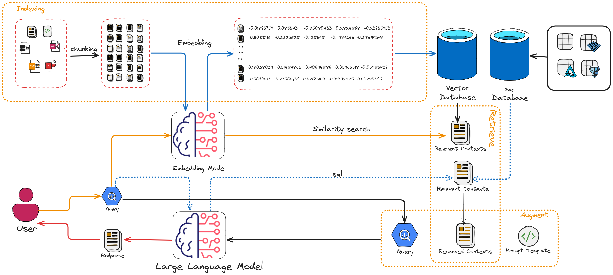

.. _rag:

==============================
Retrieval-Augmented Generation
==============================

.. _fig_rag:

    Retrieval-Augmented Generation Diagram

Overview
++++++++

Retrieval-Augmented Generation (RAG) is a framework that enhances large language models (LLMs) 
by combining their generative capabilities with external knowledge retrieval. The goal of RAG 
is to improve accuracy, relevance, and factuality by providing the LLM with specific, up-to-date, 
or domain-specific context from a knowledge base or database during the generation process.

As you can see in :ref:`fig_rag`, the RAG has there main  components

- Indexer: The indexer processes raw text or other forms of unstructured data and creates an 
  efficient structure (called an index) that allows for fast and accurate retrieval 
  by the retriever when a query is made.

- Retriever: Responsible for finding relevant information from an external knowledge source, 
  such as a document database, a vector database, or the web.

- Generator: An LLM (like GPT-4, T5, or similar) that uses the retrieved context to generate a response.
  The model is "augmented" with the retrieved information, which reduces hallucination and enhances factual accuracy.

Indexing
++++++++

Chunking
--------

Chunking in Retrieval-Augmented Generation (RAG) involves splitting documents or knowledge bases 
into smaller, manageable pieces (chunks) that can be efficiently retrieved and used by a language model (LLM).

Embedding
---------

Vector Database
---------------

Retrieval
+++++++++

Common retrieval methods:

- Sparse Search: Traditional keyword-based retrieval (e.g., TF-IDF, BM25).
- Dense Retrieval: Vector-based search using embeddings (e.g., FAISS, Pinecone).

The retriever selects "chunks" of text (e.g., paragraphs or sections) relevant to the user's query.

Generation
++++++++++